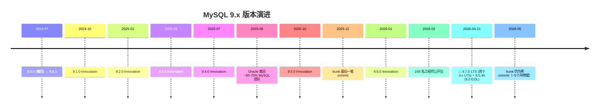
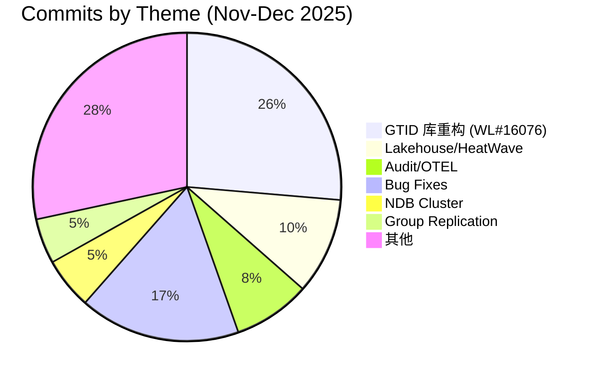

# MySQL 9.x 开发生态报告：闭源开发、9.7 LTS 与社区分裂

> **一句话摘要：** MySQL 在关闭公开开发 5 个月后发布了首个 9.x LTS 版本（9.7.0），向社区版释放了 Hypergraph Optimizer 等 8 项企业功能——但社区信任危机、工程团队缩减、Innovation Release 采纳率仅 ~1% 等问题使生态面临前所未有的分裂风险。

**读者定位：** 熟悉 MySQL 但未追踪最新动态的开发者/DBA。核心问题："MySQL 现在到底在往哪走？我该升级到 9.7 还是考虑替代方案？"

---

## 目录

1. [时间线：从 Innovation Release 到 9.7 LTS](#1-时间线从-innovation-release-到-97-lts)
2. [9.7 LTS：社区赢了什么](#2-97-lts社区赢了什么)
3. [社区风暴：公开信、裁员与信任危机](#3-社区风暴公开信裁员与信任危机)
4. [代码层面：trunk 最后活跃期的技术趋势](#4-代码层面trunk-最后活跃期的技术趋势)
5. [趋势判断：分裂格局中的关键信号](#5-趋势判断分裂格局中的关键信号)
6. [对 mysql-notes 项目的影响](#6-对-mysql-notes-项目的影响)

---

## 1. 时间线：从 Innovation Release 到 9.7 LTS



**关键事实：**

- **Innovation Release 采纳率仅 ~1%**（Percona PMM 遥测数据），7 个 Innovation 版本（9.0~9.6）被市场集体忽略
- **Percona 跳过了所有 Innovation Release**，直接从 8.0 跳到 9.7 LTS
- **8.0 系列于 2026-04-21 正式 EOL**，8.0.46 为最终版，不再有安全补丁

这不是正常的版本迭代——这是一次断裂之后的重新出发。

---

## 2. 9.7 LTS：社区赢了什么

2026 年 4 月 21 日，MySQL 9.7.0 作为首个 9.x LTS 正式 GA（支持至 ~2032 年）。同日发布的 8.0.46 标志着 8.0 时代的终结。

### 🏆 8 项企业功能下放社区版

| 功能领域 | 下放内容 | 此前锁定范围 | 影响力 |
|---|---|---|---|
| **查询优化** | Hypergraph Optimizer（超图优化器） | Enterprise/HeatWave 独占 | 🔴 极高 |
| 应用开发 | JSON Duality Views 完整 DML（INSERT/UPDATE/DELETE） | 此前仅 DDL | 🟡 中 |
| **可观测性** | OpenTelemetry 遥测（logs/metrics/traces via OTLP） | Enterprise | 🔴 极高 |
| 复制监控 | 复制应用器指标、GR 流控统计、多线程吞吐量 | Enterprise | 🟡 中 |
| 高可用 | 自动驱逐与重加入（auto-eviction & rejoin） | Enterprise | 🟡 中 |
| 高可用 | Up-to-date Aware 主节点选举 | Enterprise | 🟡 中 |
| 安全 | PBKDF2 + SHA-512 密码存储 | Enterprise | 🟢 低 |
| 安全 | 动态数据遮蔽（Dynamic Data Masking） | Enterprise | 🟡 中 |

来源：[Oracle Blog: MySQL 9.7 Is Out and the Community Wins](https://blogs.oracle.com/mysql/mysql-9-7-is-out-and-the-community-wins)

### ⚡ 焦点：Hypergraph Optimizer

这是 9.7 LTS 最具技术含量的变革：

```
传统优化器                         Hypergraph 优化器
─────────────                      ──────────────────
左深树枚举 (left-deep tree)  →     超图枚举 (bushy tree, DPhyp 算法)
多表 JOIN 空间受限            →     更大的 JOIN 排序搜索空间
固定策略选择                  →     基于成本在 nested-loop 与 hash join 间抉择
```

**使用方式：**
```sql
SET optimizer_switch='hypergraph_optimizer=on';
```

**⚠️ 注意：** 默认关闭，hint 支持不完整。建议先在灰度环境测试后再上生产。

**本地代码关联：** 在 trunk 最后活跃期中，WL#16719（Hypergraph cost model for hash-join spill-to-disk）和 WL#16658（skip scan access methods）都是为 Hypergraph 铺路的代码——这些已经在 GitHub 仓库中可见，但优化器的最终版本在内部开发。

### 🛡️ 安全默认值收紧

| 变更 | 影响 |
|---|---|
| `mysql_native_password` 彻底移除 | 所有用户须迁移到 `caching_sha2_password` |
| `caching_sha2_password_digest_rounds` → 10,000 | 暴力破解抗性大幅增强，但连接延迟增加 |
| PBKDF2 密码存储 | 替代旧 SHA-256 方案 |
| SSL/TLS 默认开启（replication） | 明文复制流量不再允许 |

### 🚫 仍被锁定的关键功能

- **`DISTANCE()` / 向量相似度搜索** → HeatWave on OCI 独占
  - Community Edition 可以**存储** `VECTOR` 数据，但**不能搜索**
  - 这是当前社区最大痛点之一——"给你数据容器，但不给你查询能力"

---

## 3. 社区风暴：公开信、裁员与信任危机

这是代码之外最重要的上下文。以下事件不会出现在 git log 中，但深刻影响着 MySQL 的未来：

### 📉 事件链

```mermaid
graph TD
    A[2025-09: Oracle 裁员<br/>MySQL 团队缩减 60–70%] --> B[2025-12: GitHub trunk<br/>完全停止 commit]
    B --> C[2026-02: 248 名工程师公开信<br/>称 MySQL 为"遗产技术"]
    C --> D[500+ 开发者联名<br/>要求建立厂商中立基金会]
    D --> E[Oracle 拒绝基金会提议]
    E --> F[2026-04: Oracle 发布 9.7 LTS<br/>承诺"新时代"]
    F --> G[社区反应分化<br/>乐观 vs 怀疑]
```

### 🔑 关键数据点

1. **工程团队缩减 60-70%**
   - Percona 创始人 Peter Zaitsev 估计
   - 影响 optimizer、InnoDB、replication 等核心模块
   - 这是 trunk 停摆 5 个月最可能的根因

2. **248 名数据库工程师公开信（2026-02）**
   - 签署者来自 Percona、MariaDB、PlanetScale、DigitalOcean、Pinterest 等
   - 核心指控：MySQL 是"遗产技术"，"有滑向无关紧要的风险"
   - 要求：路线图透明、公开开发恢复、社区治理

3. **Oracle 的回应（2026-04）**
   - 宣布 MySQL 进入"新时代"，以 9.7 LTS 为中心
   - 承诺更多功能开放给社区、改善路线图透明度
   - 重新考虑基金会模式（约 100 人签署支持——注意，是 100 人支持 vs 500+ 人联名要求）

### 📊 开源开发 vs 闭门造车

| 维度 | 2015~2024 时代 | 2025~现在 |
|---|---|---|
| 开发模式 | GitHub 公开 trunk，commit 可见 | 内部开发，GitHub 仓库 5 个月零 commit |
| 版本策略 | 8.0 单一 LTS | Innovation + LTS 双轨，但 Innovation 被市场忽略 |
| 社区关系 | 低频摩擦 | 公开信 + 基金会争议 |
| 功能方向 | InnoDB/optimizer/replication 均衡 | HeatWave/Lakehouse/AI 优先 |

---

## 4. 代码层面：trunk 最后活跃期的技术趋势

以下分析基于 MySQL trunk 在 2025 年 11~12 月（最后一次活跃窗口）的 148 个非 merge commit。



### 🔧 WL#16076 — GTID 基础设施重写（39 commits，占比 29%）

这是 MySQL 9.x 最深层的一次架构变更。

**做了什么：** 在 `libs/mysql/` 下从零构建了 11 个 C++ 底层库：

| 库名 | 功能 |
|---|---|
| `gtids` | 新 GTID 数据结构，替代旧的 `Gtid_set` |
| `uuids` | UUID 解析与比较 |
| `sets` | 泛型集合操作 |
| `strconv` | 安全字符串↔数字转换 |
| `math` | `int_log`、`int_pow` 等数学函数 |
| `containers` | `Basic_container_wrapper`、`map_or_set_assign` |
| `ranges` / `iterators` | 范围与迭代器抽象 |
| `meta` | C++20 concept 模式回移植到 C++14（模板元编程） |
| `debugging` | `MY_SCOPED_TRACE`、`Object_lifetime_tracker` |

**为什么重要：** 这是一笔**基础设施投资**——用户看不到，但为未来 GTID 性能和数据正确性提供了干净的基础。这暗示复制团队在准备一个大的功能 push。

**关键人：** Sven Sandberg（44 commits，占总量的 30%）——单人扛起了库现代化工程。

### 🏞️ Lakehouse / Parquet — 9.x 的战略新方向

4 个 WL 围绕数据湖能力：

| WL | 内容 |
|---|---|
| WL#17186 | 文件级数据放置 |
| WL#17152 | Parquet nested types（STRUCT/ARRAY/MAP） |
| WL#17124 | ALTER TABLE load validation |
| WL#17165 | Union of all schemas |

**信号：** MySQL 在向数据湖靠拢——Parquet 支持、嵌套类型、外部表。这是在和 Snowflake/Databricks 抢"查询你的数据湖"的市场。但路线图不透明，这些功能的 GA 时间表和定价模型都不明确。

### 📡 Audit Log 组件化 + OpenTelemetry

| WL | 内容 | 重要性 |
|---|---|---|
| WL#12716 | Audit Log 从旧 plugin 迁移到 8.0 组件框架 | 架构升级——动态加载/卸载、版本化 API |
| WL#17167 | P_S → OpenTelemetry logs 打通 | 云原生可观测性栈的入口 |
| WL#17178 | Audit log offload to LogAnalytics | 云集成 |

这组 WL 标志着 MySQL 向云原生可观测性靠拢——OTEL traces/logs/metrics 是 modern stack 的标准配置。

### 🐛 关键 Bug 修复

| Bug | 严重度 | Commits | 描述 |
|---|---|---|---|
| Bug#38573285 | 🔴 严重 | 3 | CPU-eating DoS 查询——精心构造的 SQL 可无限消耗 CPU |
| Bug#38448700 | 🔴 严重 | 3 | EXPLAIN + LEFT JOIN + derived table + stored function → crash |
| Bug#38208188 | 🟡 中 | 2 | Bulk insert + GIS index → crash |
| Bug#38680162 | 🟡 中 | 1 | SET PERSIST 升级后产生重复项 |

### 🔒 InnoDB：零架构变更

在最后活跃期中，InnoDB 的 6 个 commit 全部是 bug 修复，**无新特性**。InnoDB 在 9.x 此阶段已进入稳定/成熟状态——这可能是资源重新分配的信号（团队被调去做 HeatWave/Lakehouse）。

---

## 5. 趋势判断：分裂格局中的关键信号

### 🧭 五个关键判断

**1. MySQL 进入了"闭源开发 → 定期发布"模式。**

GitHub trunk 5 个月零 commit 不是疏忽——是 Oracle 的**刻意选择**。9.7 LTS 的 Hypergraph Optimizer 和其他企业功能是在内部开发、打包、测试后一次性发布的。这对社区意味着：你不再能在 GitHub 上追踪 MySQL 的日常演进。信任模型从"看代码判断方向"变成"看发布猜方向"。

**2. Innovation Release 模型已经失败。**

~1% 的采纳率说明市场根本不接受每季度一次的"非 LTS"版本。DBA 不愿意在生产环境跑 Innovation Release，Percona 等关键下游完全跳过。Oracle 需要重新考虑这个模型——要么让 Innovation Release 有足够吸引力（比如放更多新功能），要么放弃它。

**3. 社区分裂正在加速。**

248 名工程师公开信 + 500+ 人联名是 MySQL 历史上最严重的社区信任危机。这不是"要不要升级"的问题——是有没有**可信的未来路线图**的问题。对于新项目，"选 Percona/MariaDB 还是 MySQL 官方"正在从一个技术问题变成一个政治/信任问题。

**4. 9.7 LTS 是一个有用的版本，但不解决根本问题。**

Hypergraph Optimizer 进社区版是实质利好。OTEL 可观测性、动态数据遮蔽也是。但这些是**当前的礼物**，不是**未来的保证**。核心问题——开发透明度和社区治理——未被触及。

**5. HeatWave/Lakehouse 路线图不透明是最大风险。**

MySQL 在向数据湖和 AI 方向投入大量资源，但这些功能的交付模式、定价、GA 时间表完全在 Oracle 的黑箱中。如果你基于"MySQL 将来支持 Lakehouse"做架构决策，你赌的是 Oracle 的善意，而不是公开的路线图。

### 📊 技术选型速查表

| 场景 | 建议 | 理由 |
|---|---|---|
| 现有 8.0 用户，需要 LTS | ✅ 升级到 9.7 LTS | 8.0 已 EOL，9.7 是唯一 LTS 路径 |
| 新项目，需要多源复制/Galera | 考虑 Percona XtraDB Cluster 或 MariaDB | 功能更成熟，社区治理更透明 |
| 新项目，需要 hypergraph optimizer | ✅ MySQL 9.7 | 这是 MySQL 当前的独家优势 |
| 需要向量搜索 | ❌ MySQL Community Edition 不行 | `DISTANCE()` 仍锁定在 HeatWave on OCI |
| 需要 Lakehouse/Parquet 查询 | ⚠️ 观望 | 功能在 trunk 中可见但路线图不透明 |
| 需要 GTID 高级功能 | ✅ MySQL 9.7 | WL#16076 的库重构为未来 GTID 功能铺了路 |

---

## 6. 对 mysql-notes 项目的影响

### 版本基线调整

- **代码分析基线：** 当前 trunk HEAD (`447eb26e094`) 是最后一个公开 commit——之后的分析只能基于"推断"而非"观察"
- **文章版本标注：** 使用 `MySQL 9.7.0` 而非 `MySQL 9.6.0`，因为 9.7 是实际可用的 LTS 版本
- **多产品对比：** Percona 和 MariaDB 的版本需要同步追踪——社区分裂意味着"MySQL vs 替代品"的对比变得更重要

### 研究优先级调整

**高优先级：**
1. **Hypergraph Optimizer 深度解读** — 这是 9.7 最大的技术亮点，社区版用户可以实际使用
2. **MySQL vs Percona vs MariaDB 选型指南** — 社区分裂背景下决策需求急剧增加
3. **GTID 新库体系源码解读** — WL#16076 的 11 个新库是理解未来复制功能的关键

**中优先级：**
4. **Audit Log 组件化分析** — 架构迁移模式案例研究
5. **OTEL 可观测性堆栈** — MySQL 云原生化的重要一步

**低优先级（观望）：**
6. Lakehouse/Parquet — 路线图不透明，等 GA 后再深入

### 🗓️ 待办事项

- [ ] 等待 9.7 LTS 源码在 GitHub 上公开，验证 Hypergraph Optimizer 的实际代码
- [ ] 协调 @mns-scout 建立 9.7 LTS 用户反馈监控（bug reports、性能 regressions）
- [ ] 协调 @mns-comparator 产出 MySQL 9.7 vs Percona vs MariaDB 最新对比

---

## 附录：关键来源

| 来源 | 类型 | 链接 |
|---|---|---|
| MySQL 9.7 Release Notes | 官方 | https://dev.mysql.com/doc/relnotes/mysql/9.7/en/news-9-7-0.html |
| Oracle Blog: "MySQL 9.7 Is Out and the Community Wins" | 官方 | https://blogs.oracle.com/mysql/mysql-9-7-is-out-and-the-community-wins |
| Planet MySQL: Hypergraph Optimizer in Community | 社区 | https://planet.mysql.com/?tag_search=25057 |
| @mns-reader 源码分析 | 内部 | `notes/mysql-server/_index/2026-05-16-mysql-trunk-dev-activity-analysis.md` |
| @mns-scout 社区简报 | 内部 | #mysql-notes thread |
| @mns-comparator 代码变更全景 | 内部 | #mysql-notes thread |

---

*本报告基于 2026-05-16 可用信息。MySQL 生态变化迅速——所有趋势判断均为"当前可见信号"的解读，非预测。*
