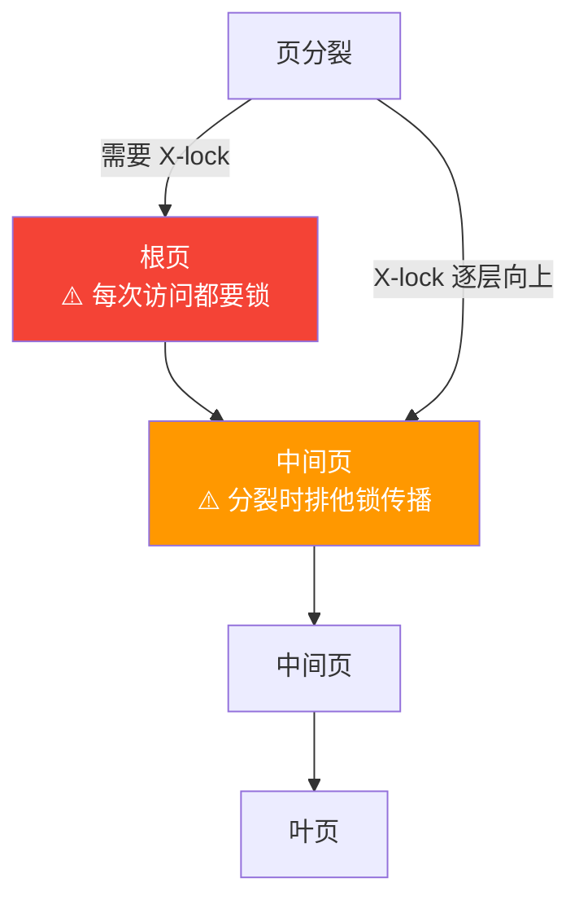
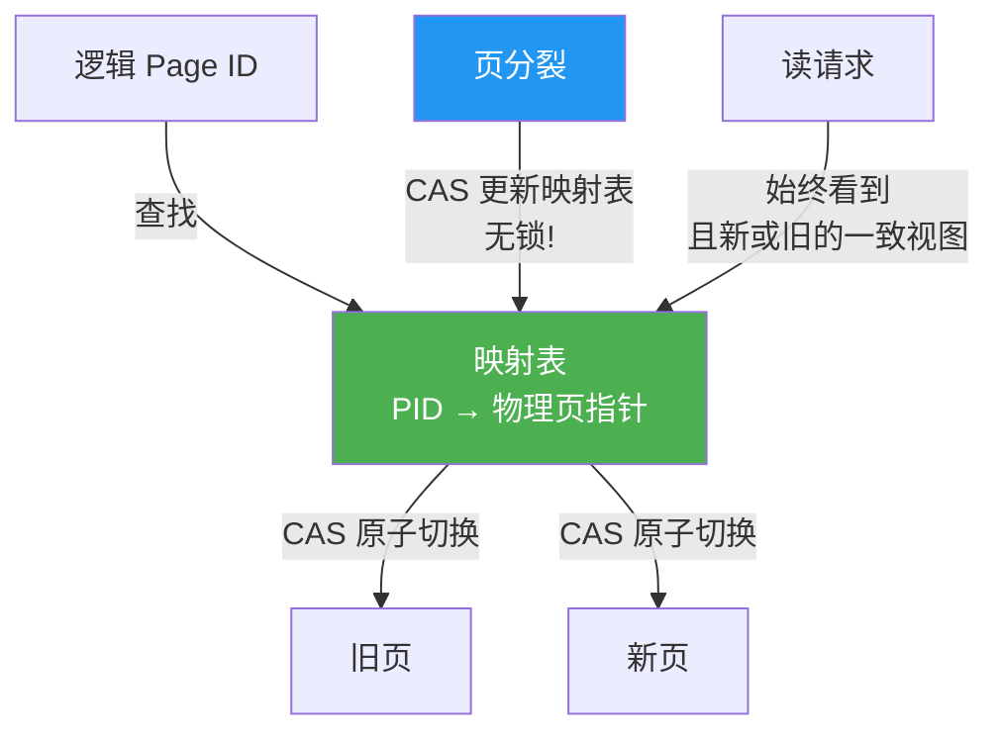

# 一张图看懂：BwTree — 为什么 AHI 是 MySQL 的无锁 B-tree 起点

> **一句话：** BwTree 用映射表 + CAS 消除了 B-tree 所有锁。惊喜发现：InnoDB 的 AHI（自适应哈希索引）已经是 BwTree 的思想雏形。

---

## 传统 B-tree 的锁痛点



- **根页** = 热点：每个事务都要访问，锁竞争最激烈
- **页分裂** = 长排他锁：从叶到根逐层 X-lock，阻塞整棵子树

---

## BwTree 怎么消除锁？



**关键思想：不直接指向页，通过映射表间接访问。** 分裂 = CAS 更新映射表，读者看到旧映射或新映射——都是正确的。

---

## 🎯 AHI = MySQL 的 BwTree 雏形

**InnoDB 的 Adaptive Hash Index (`btr0sea.cc`)**:

```
AHI 做的事：                        BwTree 需要做的事：
(索引ID, 键前缀) → 页指针           (Page ID) → 物理页指针
   ↑ 已经是无锁的！                    ↑ 从这里扩展！
```

**AHI 已经维护了一个无锁的 key → page 映射！** 把它从"键前缀哈希 → 页"推广为"页 ID → 物理页"——就是从 AHI 到 BwTree 映射表的距离。

---

## MySQL 能不能用？

| | 判断 | 风险 |
|---|---|---|
| ✅ **CAS 页分裂** | 只改分裂路径，不动读路径。替换 `btr_page_split_and_insert` 中的 X-lock 为 CAS 映射表更新 | 低——无新锁序边，可证明无死锁 |
| ⚠️ **AHI → 完整映射表** | AHI 是自适应的（懒构建、压力下驱逐），映射表必须完整——从"缓存热门"到"索引一切"的跃迁 | 中——需独立缓冲区分配，小 buf_pool 不适用 |
| ❌ **全 BwTree（含 delta 链）** | Delta 链在内存快（~5ns），在磁盘灾难（~5ms/page）。InnoDB 是 disk-based | 高——仅适用于内存优化表 |

---

## 🛤️ 最务实的渐进路径


**第 1 步就是最大的胜利** —— 页分裂是最长排他锁的源头，用 CAS 消灭它，不改任何读路径。

---

## 记住这三件事

1. **AHI 已经是 BwTree 的思想雏形** — 无锁 key→page 映射就在 `btr0sea.cc` 里，不是从零开始
2. **CAS 页分裂是渐进式改进的黄金路径** — 可证明无死锁，不改读路径，先解决最痛的点
3. **Delta 链在磁盘上是灾难** — 全 BwTree 只能用于内存表，InnoDB 主力场景是 disk-based

---

> 📖 深入阅读：[BwTree 完整论文卡片](notes/2026-05-16-mysql-bwtree.md)
> 🔗 关联：[Lock-Free 技术演进总览](notes/2026-05-16-mysql-lock-free-oltp-lineage-learning-card.md)
