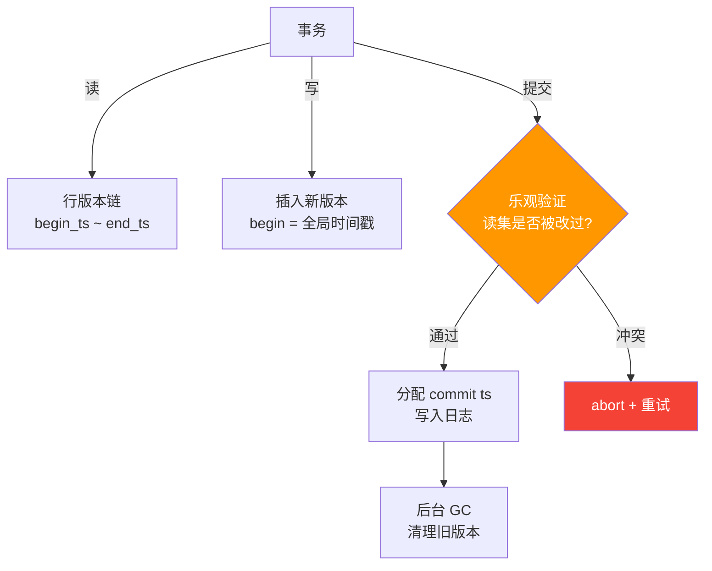

# 一张图看懂：Hekaton — 唯一量产的无锁 OLTP 引擎

> **一句话：** SQL Server 2014 内置的 Hekaton 证明了无锁可以量产——但代价是"功能换性能"。它是 MySQL 最值得研究的工程教训。

---

## 为什么 Hekaton 特别？

**4 篇论文中唯一一个真正出货的系统。** 它的生产故障模式比任何学术数据更有价值。

---

## 无锁如何工作？

**关键差异：** 无锁 = 无等待。冲突不阻塞，直接 abort + retry。

---

## 🔴 三个量产失败模式

| 故障 | 表现 | 根因 | MySQL 对等物 |
|---|---|---|---|
| **GC 版本清理滞后** | 10K 版本链 → 40-60% 吞吐量下降 | 后台清理跟不上写入速度 | InnoDB purge thread (`row0purge.cc`) |
| **验证 abort 风暴** | 热点行 90%+ abort 率 → CPU 空转在 retry | 乐观并发 + 热点 = 重试死循环 | `innodb_spin_wait_delay` 高竞争抖动 |
| **检查点碎片** | 恢复时间 ∝ 碎片数量 | checkpoint 文件无限增长 | 类似 InnoDB redo log 无限增长场景 |

---

## 修复了什么？

| 故障 | Hekaton 修复（SQL Server 2016） | 对 MySQL 的启示 |
|---|---|---|
| GC 滞后 | ① 版本链硬上限（默认 100）→ 超过后**阻塞写** ② 合作式 GC：每个读线程顺手清理 1~2 个版本 | 给 `row0purge.cc` 加一个"读路径顺手清理"的 hook，上限 2 版本/读 |
| Abort 风暴 | ① 指数退避 + 抖动（1ms→10ms→100ms）② 热点行哈希分桶 | `innodb_spin_wait_delay` 升级到事务级退避 |
| 检查点碎片 | 增量检查点 + 后台合并 | InnoDB 已有增量 checkpoint，差距在碎片合并 |

---

## MySQL 能不能用？

| | 判断 |
|---|---|
| ❌ **不能整体搬** | InnoDB 的 undo-log MVCC ≠ Hekaton 的行内版本存储——需要全新 `ha_hekaton` handler |
| ❌ **最大 blocker** | Hekaton 只有 SI + Serializable，**无 READ COMMITTED**——MySQL 生态离不开 RC |
| ✅ **可以学** | 合作式 GC（读路径清理 1-2 版本）、事务级指数退避、版本链硬上限 |

---

## 记住这三件事

1. **无锁的代价是功能面缩小** — Hekaton 放弃了 FK、DML 触发器、READ COMMITTED，不是免费的午餐
2. **生产故障比实验室性能数据重要 10 倍** — GC 滞后、abort 风暴、检查点碎片才是真实问题
3. **合作式 GC 是最立刻可用的启示** — 不需要任何锁免基础设施，只是一个读路径 hook

---

> 📖 深入阅读：[Hekaton 完整论文卡片](content/2026-05-16-mysql-hekaton.md)
> 🔗 关联：[Lock-Free 技术演进总览](content/2026-05-16-mysql-lock-free-oltp-lineage-learning-card.md)
