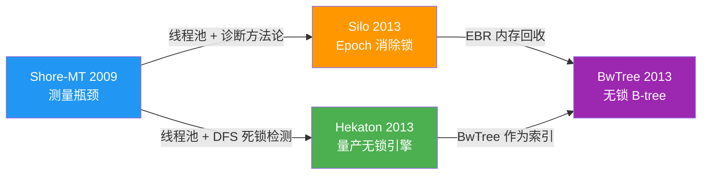
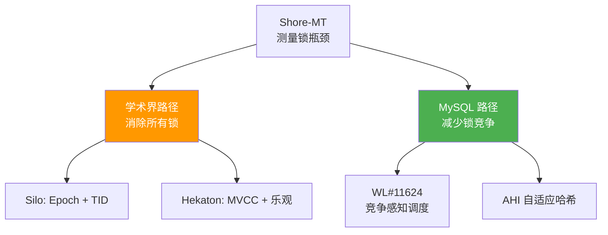

# 一张图看懂：Lock-Free OLTP 技术演进

> **30 秒速览：** 4 篇论文，一条主线——从"测量锁瓶颈"到"消除所有锁"，但 MySQL 走了另一条路。

---

## 演进路线图

🟢 **Hekaton** = 唯一量产 | 🔵 **Shore-MT** = 方法论基石 | 🟠 **Silo** = 纯学术 | 🟣 **BwTree** = 工业试验

---

## 核心继承链：谁留下了什么？

| Shore-MT 概念 | Silo | Hekaton | BwTree | MySQL 现状 |
|---|---|---|---|---|
| **线程本地池** | ✅ 保留+EBR | ✅ 保留+epoch GC | ✅ 保留 | ✅ `THD::mem_root` 已有 |
| **2PL 锁管理器** | ❌ → TID 序列化 | ❌ → MVCC+乐观 | N/A | ✅ 仍用 `lock_sys` |
| **死锁检测 DFS** | ❌ (无死锁) | ❌ (abort+retry) | N/A | ✅ `lock_deadlock_detect` |
| **页锁 (page latch)** | ❌ → Masstree | ❌ → BwTree | ✅ → 映射表 | ✅ `rw_lock` |
| **瓶颈诊断方法** | ✅ 继承 | ✅ 继承 | ✅ 继承 | ❌ **缺失——最大机会** |

> **规律：** 只有**线程本地池**被所有后继保留。MySQL 已经有了——差距在共享结构分配。

---

## 两条路：学术界 vs MySQL

| | 学术界 (Silo/Hekaton) | MySQL 工程实践 |
|---|---|---|
| 策略 | 消除锁 | 减少锁竞争 |
| 代价 | 缩小功能面（隔离级别、触发器等） | 保留全部功能 |
| 适用 | 纯 OLTP | 通用 RDBMS |
| 代表 | Hekaton = 22x TPS 提升（但无 READ COMMITTED） | WL#11624 = 竞争感知调度 |

**结论：MySQL 的选择是工程 tradeoff，不是技术落后。**

---

## 投资优先级：现在能做什么？

| 优先级 | 方向 | 风险 | 论文依据 |
|---|---|---|---|
| 🥇 先做 | **Shore-MT 式瓶颈诊断** — 测量 `lock_sys` / `trx_sys` / page latch 在现代硬件上的真实竞争度 | 低 | Shore-MT 方法论 |
| 🥈 再做 | **CAS 页分裂** — 消除 split 时的长时间排他锁（BwTree 映射表思想） | 中 | BwTree 可分离优化 |
| 🥉 再说 | **合作式 GC** — 读路径顺便清理 1~2 个版本 | 中 | Hekaton 版本清理 |
| ⏸️ 暂缓 | **全无锁 InnoDB** — 需要新 handler、丢 READ COMMITTED | 高 | Hekaton 隔离级限制 |

---

## 记住这三件事

1. **Shore-MT 的瓶颈诊断方法比任何锁免算法都重要** — 先测清楚哪里痛，再决定怎么治
2. **Hekaton 证明了无锁可以量产** — 但代价是"功能换性能"（无 FK、无触发器、无 READ COMMITTED）
3. **BwTree 给了最务实的渐进路径** — CAS 页分裂可以不碰读路径，风险最低

---

> 📖 深入阅读：Shore-MT / Silo / Hekaton / BwTree 完整论文卡片（同目录 .md 文件）
