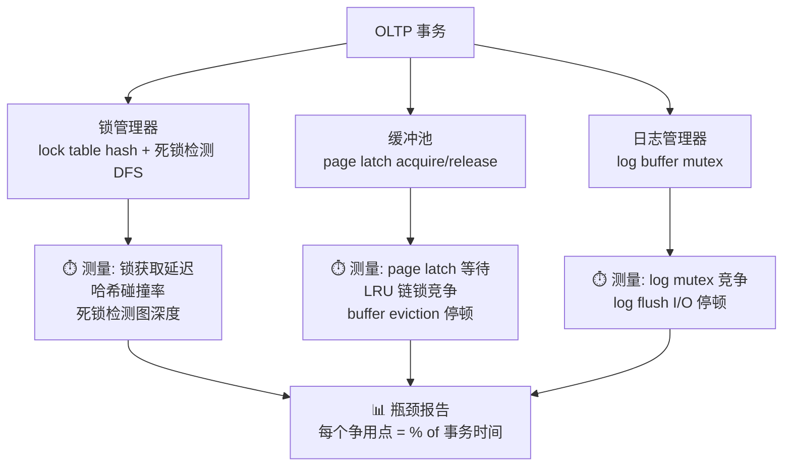

# 一张图看懂：Shore-MT — 为什么"测量"比"去锁"更重要

> **一句话：** 在被所有无锁论文当作基线之前，Shore-MT 是第一个系统回答"锁到底慢在哪"的项目。MySQL 至今没做过同级别的瓶颈测量。

---

## 核心机制

**不是新算法——是测量工具。** 在每个争用点插入 cycle-accurate 时间戳，告诉你 CPU 时间花在哪。

---

## 什么活了下来？

4 篇后继论文中，**只有一个 Shore-MT 设计被所有人保留：**

| 设计 | Silo | Hekaton | BwTree | MySQL |
|---|---|---|---|---|
| **线程本地内存池** | ✅ | ✅ | ✅ | ✅ `THD::mem_root` |
| 2PL 锁管理器 | ❌ | ❌ | N/A | ✅ `lock_sys` |
| 死锁检测 DFS | ❌ | ❌ | N/A | ✅ `lock_deadlock_detect` |
| 瓶颈测量方法 | ✅ | ✅ | ✅ | ❌ |

> **MySQL 没有做 Shore-MT 式瓶颈测量。** 这是当前最大的知识缺口。

---

## MySQL 能不能用？

| | 判断 |
|---|---|
| ✅ **能直接用** | 瓶颈测量方法论——插桩 `lock_sys->wait_mutex`、`trx_sys->mutex`、page latch 等待时间 |
| ✅ **已经有了** | 线程本地池 = `THD::mem_root` |
| ❌ **不适用** | Shore-MT 的 2009 硬件基线 (16核 Xeon) — 年代太久，不能直接引用数据 |

---

## WL#11624：MySQL 的"Shore-MT 回应"

MySQL 8.0 的 **竞争感知事务调度 (WL#11624)** 是 MySQL 对 Shore-MT 发现的工程回应：

- Shore-MT 发现：锁竞争导致 CPU 空转
- WL#11624 方案：**不消除锁，但让竞争的事务排队等**，减少 spin-wait 浪费
- 这是"减少锁危害"路线，不是"消灭锁"路线

---

## 记住这三件事

1. **Shore-MT 是一次诊断，不是一个产品** — 它的价值在方法论："先测量，再优化"
2. **线程本地池是唯一被所有人接受的优化** — MySQL 的 `THD::mem_root` 已经是了，差距在共享结构
3. **在现代硬件上重做 Shore-MT 式诊断** — Apple Silicon / AMD EPYC 上 InnoDB 的瓶颈在哪？这可能是一篇可发表的工程论文

---

> 📖 深入阅读：[Shore-MT 完整论文卡片](notes/2026-05-16-mysql-shore-mt.md)
> 🔗 关联：[Lock-Free 技术演进总览](notes/2026-05-16-mysql-lock-free-oltp-lineage-learning-card.md)
