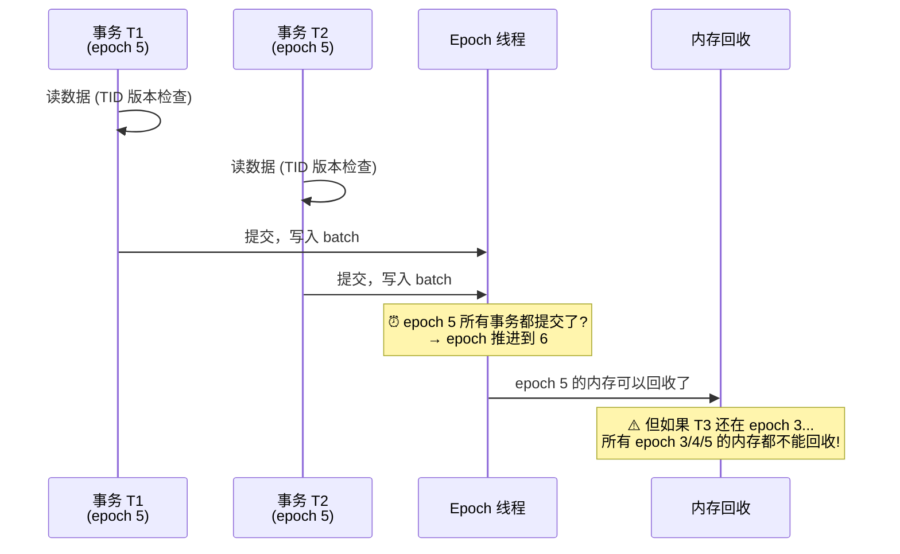

# 一张图看懂：Silo — Epoch 无锁事务为什么不能搬进 MySQL

> **一句话：** Silo 用 epoch（纪元）替代了所有锁，实现了 700K TPS。但一个 `SELECT SLEEP(3600)` 就能让整个系统 OOM——这是 MySQL 的死穴。

---

## Epoch 如何替代锁？

**关键约束：** 必须等所有线程都跨过 epoch N，才能释放 epoch N 的内存。一个慢线程拖死所有人。

---

## 三个致命问题（对 MySQL）

| 问题 | 论文里怎么说 | MySQL 为什么不行 |
|---|---|---|
| 🚫 **Epoch 滞后** | ERMIA 2016 修复：强制滞后线程定期 check-in | MySQL 无法"强制 evict 一个连接"——太多遗留应用依赖长连接 |
| 🚫 **全内存** | Silo 假设所有数据在内存 | InnoDB 是 disk-based，undo log 在磁盘 |
| 🚫 **TID 序列化** | 事务提交顺序由 TID 决定，不是 commit 时间 | 与 InnoDB 的 MVCC（基于 trx_id 可见性）不兼容 |

---

## MySQL 能不能用？

| | 判断 |
|---|---|
| ❌ **不能直接用** | Epoch 模型与 MySQL 连接模型冲突——长连接 = OOM |
| ⚠️ **可以部分借鉴** | TID 序列化思想 → 与 MGR 写集认证结合？ |
| ✅ **可以学方法** | 在 THD 加一个 `current_epoch` 字段（无侵入），先做实验 |

---

## 🔮 一个未被探索的方向

**Silo 的确定性 TID 序列化 + MySQL Group Replication 写集认证**

如果每个 MGR 节点对同一组写集产生相同的序列化顺序，MGR 的乐观认证就不会有冲突回滚——认证变成确定性的检查，而不是冲突解决机制。

这是 Silo 论文在 MySQL 生态中最有想象力的映射，但完全是未探索领域。

---

## 记住这三件事

1. **Epoch 和长连接互斥** — 只要 MySQL 允许 `SELECT SLEEP(3600)`，纯 Epoch 方案就是死路
2. **Silo 的价值不在"能用"，在"定义了无锁事务的边界"** — 它划出了什么能做、什么不能做的清晰界限
3. **MGR + 确定性序列化是潜在的突破点** — 目前没人探索过

---

> 📖 深入阅读：[Silo 完整论文卡片](content/2026-05-16-mysql-silo.md)
> 🔗 关联：[Lock-Free 技术演进总览](content/2026-05-16-mysql-lock-free-oltp-lineage-learning-card.md)
