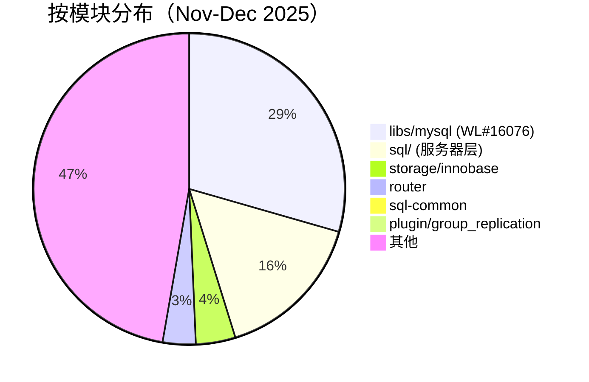

# MySQL 9.6.0 (trunk) 近期开发活动分析

> **基线：** MySQL 9.6.0 (trunk)，HEAD commit `447eb26e094`（2025-12-23）。
> **覆盖范围：** 148 个非合并 commit，覆盖 2025 年 11–12 月。2026 年 1–5 月零新 commit。

---

## 总览



**最大的单项投入是 WL#16076 —— GTID/复制库的 39 步重构**，由 Sven Sandberg 主导（44 个 commit），占全部非合并工作的约 29%。并行推进的线索包括 Lakehouse/HeatWave 功能、Audit Log 组件化、以及若干关键 crash/DoS bug 修复。

---

## 1. WL#16076 — GTID 与复制库重构（39 commits）

### 是什么

MySQL 内部 C++ 库的彻底重构，构建了以下干净抽象层：

- **GTIDs**（`gtids` 库）：取代 `mysql::gtid::Gtid_set` 的新数据结构
- **UUIDs**（`uuids` 库）：解析与比较
- **Sets**（`sets` 库）：通用集合操作
- **字符串转换**（`strconv` 库）：安全的 string↔number 转换
- **数学**（`math` 库）：`int_log`、`int_pow`、求和函数
- **容器**（`containers` 库）：`Basic_container_wrapper`、`map_or_set_assign`
- **区间与迭代器**（`ranges`、`iterators` 库）
- **元编程**（`meta` 库）：C++20 风格 concept 回移植到 C++14
- **调试**（`debugging` 库）：`MY_SCOPED_TRACE`、`Object_lifetime_tracker`、`oom_test`

### 关键 commit

| 步骤 | Commit | 描述 |
|------|--------|------|
| 39 | `5cd325a9b9f` | 在 mysqlbinlog 中使用新 Gtid 数据结构 |
| 38 | `129723c8437` | 替换旧的 `mysql::gtid::Gtid_set` |
| 37 | `b781b664a4a` | 与 GTID_SUBSET 和 GTID_SUBTRACT 集成 |
| 36 | `a6ff21a5129` | 新建 gtids 库 |
| 35 | `a9421c575a2` | 新建 uuids 库 |
| 34 | `9f9a3ac8be1` | 新建 sets 库 |
| 32 | `50989798cc5` | 新建 strconv 库 |
| 27 | `e30861d3882` | 新建 ranges 库 |
| 26 | `2d34be2b9bd` | 新建 iterators 库 |
| 13 | `784c130f6cd` | 新建 debugging 库 |
| 4  | `11a78222be0` | 新建 meta 库 |

### 影响面

- **全部在 `libs/mysql/` 下** — 共享库，被 server、mysqlbinlog、router 及各类插件消费
- 步骤 36–39 将新库接入生产代码（GTID、mysqlbinlog）
- meta 库引入了可在 C++14 中使用的 C++20 concept 模式 — 编译期类型检查的模板元编程
- **关键变量生命周期：** header-only 或 header+inline 形式。无动态分配 — 尽可能 constexpr/编译期求值

### 并发安全

库本身是值类型（无共享可变状态）。安全取决于服务器层如何使用 — GTID 集合必须跨线程拷贝而非共享。

---

## 2. Lakehouse / HeatWave（4 个 WL）

| WL | 描述 | 模块 |
|----|------|------|
| WL#17186 | Lakehouse 文件级数据放置 | HeatWave |
| WL#17152 | 支持 Parquet nested types | HeatWave |
| WL#17124 | 新增 ALTER TABLE：加载校验 | DDL/HeatWave |
| WL#17165 | Lakehouse 所有 Schema 联合 | HeatWave |

### 分析

HeatWave/Lakehouse 在 9.x 中仍是重点投资方向：

- **Parquet nested types**（WL#17152）：将 Parquet 支持从 flat schema 扩展到 STRUCT/ARRAY/MAP — 对真实数据湖 workload 至关重要
- **文件级数据放置**（WL#17186）：控制 Lakehouse 文件到物理存储的映射关系
- **加载校验**（WL#17124）：新增 ALTER TABLE 操作用于校验 Lakehouse 数据加载

### 🔴 与 HeatWave 整体战略的关联

MySQL 9.x 的 Innovation 轨道是 HeatWave 功能的载体 — 这些无法进入 8.0/8.4 LTS。此处的 Parquet/Lakehouse 是服务器内置功能，与云独占的 HeatWave 服务不同。

---

## 3. Audit Log 与可观测性（3 个 WL）

| WL | 描述 | 影响 |
|----|------|------|
| WL#12716 | Audit Log plugin 组件化 | 架构级：从 legacy plugin 迁移到 MySQL 8.0 component framework |
| WL#17167 | PERFORMANCE_SCHEMA 增加 OTEL logs 埋点 | 可观测性：打通 P_S → OpenTelemetry |
| WL#17178 | Audit log offload 适配 LogAnalytics | 云集成 |

### 分析

- **WL#12716** 架构意义最大：将 Audit Log 组件化后与 keyring、clone 等 component 处于同一框架，支持动态加载/卸载和版本化 API
- **WL#17167** 是可观测性布局：将 Performance Schema 埋点接入 OpenTelemetry logs，面向 AWS CloudWatch/Azure Monitor/GCP Cloud Logging 等云原生监控栈

---

## 4. Foreign Key Cascading（WL#11249）

```
9e1e77fac10 WL#11249 - Support Foreign Key Cascading Operation in server
```

### 可能带来的能力

FK cascading（ON DELETE CASCADE / ON UPDATE CASCADE）传统上在存储引擎层执行。此 WL 将 cascade 逻辑提升到 SQL 层，从而支持：

- 跨引擎级联（InnoDB → NDB 等）
- 更好的 cascade 失败错误报告
- 潜在方向：并行 cascade 执行

### 🔴 风险点

FK cascading 本质上是递归的，可能触发死锁。提升到服务器层新增了一条代码路径，必须与存储引擎自身的 FK 执行逻辑协调。

---

## 5. 关键 Bug 修复

### 🔴 Bug#38573285 — CPU 耗尽型 Denial of Service 查询（3 commits）

```
b56c64b2947 Bug#38573285 MySQL server: CPU-eating Denial_of_Service query
770772d3d70 Bug#38573285 MySQL server: CPU-eating Denial_of_Service query
ebdf65e0703 Bug#38573285 MySQL server: CPU-eating Denial_of_Service query
```

同一 bug 拆分三个 commit — 说明修复涉及多个子系统（很可能是 optimizer + executor）。本窗口内严重程度最高：一个精心构造的查询可以无限消耗 100% CPU。

### 🔴 Bug#38448700 — EXPLAIN SELECT 导致 server crash（3 commits）

```
44361ef23da Bug#38448700: Server crash with EXPLAIN SELECT on LEFT JOIN with derived table containing stored function and GROUP BY
2bc8767f591 Bug#38448700: Server crash with EXPLAIN SELECT on LEFT JOIN with derived table containing stored function and GROUP BY
572f252c253 Bug#38448700: Server crash with EXPLAIN SELECT on LEFT JOIN with derived table containing stored function and GROUP BY
```

EXPLAIN 导致 server crash — 关键稳定性问题。LEFT JOIN + derived table + stored function + GROUP BY 产生复杂优化计划，EXPLAIN 在此触发了未处理的边界情况。

### 🟡 Bug#38208188 — Bulk insert + GIS index 崩溃

```
a9cf8c54580 Bug#38208188: Bulk inserts into temporary tables with GIS indexes will inevitably cause crashes
d338ba09220 Bug#38208188: Bulk inserts into temporary tables with GIS indexes will inevitably cause crashes
```

### 🟡 Bug#38680162 — SET PERSIST 产生重复条目

```
1a78995a233 Bug#38680162 SET PERSIST creates duplicate variable entries across sections after upgrade
```

### 🟡 Bug#38077617 — 初始握手始终使用 caching_sha2_password

```
c3956ef47af Bug#38077617: MySQL 8.4 always uses caching_sha2_password in the initial connection handshake
```

---

## 6. Group Replication / Router

| WL | 描述 |
|----|------|
| WL#17008 | 为 GCS/XCOM trace 文件增加时间戳 |
| WL#17027 | 将 Router volatile 统计存入 `mysql_innodb_cluster_metadata` 专用表 |
| WL#17184 | 允许重定义 secondary engine |

### 分析

- **WL#17008**：GCS/XCOM（Group Communication System）是 MGR 的共识层。增加时间戳提升可调试性——目前诊断 MGR 停滞需跨节点按消息内容关联日志，无法按时间排序
- **WL#17027**：Router 统计原本仅存内存。写入 `mysql_innodb_cluster_metadata` 后支持历史分析（如"凌晨 3 点是否有路由问题？"）
- **WL#17184**：无需 drop/recreate 即可更改 secondary engine，与 HeatWave secondary engine 场景相关

---

## 7. NDB Cluster 修复

本窗口内多项 NDB 专项 bug 修复，说明 NDB Cluster 仍在活跃维护：

- `Bug#38608189` / `Bug#38608102` — ndbxfrm/ndb_restore 修复
- `Bug#38558868` — ndb_restore 并行度修复
- `Bug#38593666` — ndb_restore 跳过 FK 检查的选项
- `Bug#38592288` — backup/restore 报告差异修复

---

## 8. 构建与打包

- `BUG#38784394` — mysql 包在 FC43 (Fedora) 冲突
- `BUG#38758163` — MSVC 19.29 (VS16.11) 构建修复
- `BUG#38730874` — pb2 mysql-trunk-cloud-asan bulk load 失败（ASAN 修复）
- `BUG#38330571` — cmake/abi_check.cmake 在 Windows 11 24h2 卡死

---

## 关键变量：贡献者集中度

```
Sven Sandberg      44 commits  （WL#16076 — GTID 库重构）
Mauritz Sundell     8 commits  （NDB Cluster / build）
Frazer Clement      8 commits  （NDB Cluster）
Miroslav Rajcic     6 commits
Marc Alff           4 commits
Magnus Blåudd       4 commits
Knut Anders Hatlen  4 commits
Kajori Banerjee     4 commits
```

**148 commits 中 44 个（30%）来自同一作者。** Sven Sandberg 显然是库现代化工作的主导者。

---

## 时间线分析

```
2025-11: 101 commits  ← 活跃高峰（WL#16076 批量、Lakehouse 功能）
2025-12:  47 commits  ← 收尾期（bug 修复、post-push fix、merge）
2026-01:   0 commits  ← 假期停摆
2026-02:   0 commits  ←
2026-03:   0 commits  ←
2026-04:   0 commits  ←
2026-05:   0 commits  ←（截至 5 月 16 日）
```

距上次 commit（2025-12-23）已 5 个月无新提交，值得关注。可能原因：

1. Oracle 内部开发使用独立仓库；trunk 仅接收周期性合并
2. 假期延续至 Q1 规划期
3. 重大版本（9.6.0 GA）在独立 stabilization 分支准备

---

## 趋势与要点

1. **库现代化是头号投资。** WL#16076 对 `libs/mysql/` 的 39 步重构不是用户可见功能 — 是为未来 GTID/复制工作的基础设施。暗示复制团队正在准备重大功能推进。

2. **HeatWave/Lakehouse 是第二优先级。** 4 个 WL 覆盖 Parquet、数据放置、加载校验、schema 联合。MySQL 9.x Innovation 是载体。

3. **可观测性在成熟。** Audit Log 组件化 + OTEL 埋点 + LogAnalytics offload = 云原生可观测性栈。

4. **关键稳定性修复。** CPU 耗尽型 DoS 查询和 EXPLAIN crash bug 各需 3 个 commit — 多子系统复杂修复。

5. **NDB Cluster 仍在活跃维护** — 虽是小众引擎，2 名专职工程师产出 8 个 commit。

6. **Group Replication 强化是增量式的** — 时间戳、统计持久化、secondary engine 重定义 — 非架构级变更。

7. **InnoDB 核心架构零变更。** 6 个 InnoDB commit 全是 bug 修复，无新功能。InnoDB 在 9.x 当前阶段处于稳定/成熟状态。
