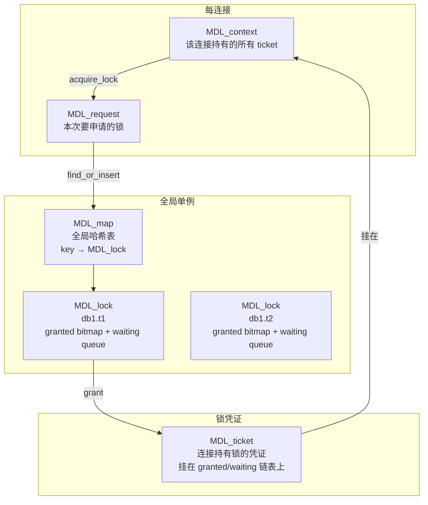
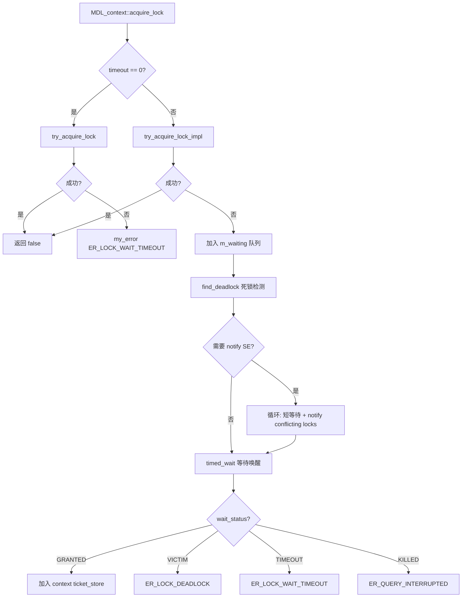
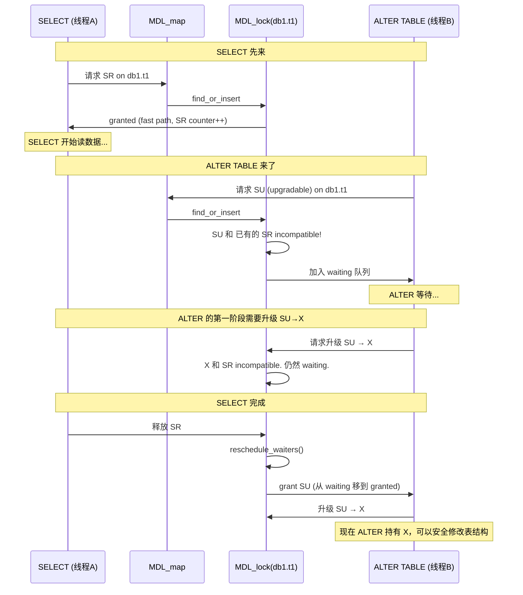

# MySQL MDL 源码深度剖析

> **源码基线：** MySQL 9.6.0 (trunk), `sql/mdl.h` 1750行 + `sql/mdl.cc` 4923行，共 6673 行。
> **解决什么问题：** 保护数据库元数据（表结构、schema、存储过程等）在并发访问下的一致性。DDL 不能和 DML 同时跑在同一个表上，MDL 就是实现这个互斥的机制。

---

## 一、核心数据结构

### 1.1 整体架构：三层的锁管理体系



### 1.2 MDL_key：锁的"身份证"

```cpp
// MySQL 9.6.0, sql/mdl.h:366
struct MDL_key {
  uint16 m_length{0};               // 有效长度
  uint16 m_db_name_length{0};       // 数据库名长度
  uint16 m_object_name_length{0};   // 对象名长度
  char m_ptr[MAX_MDLKEY_LENGTH]{0}; // 387字节定长 buffer
  // 编码格式: [namespace(1B)][db\0][name\0][col?\0]
};
```

**内存布局（以表 `test.t1` 为例）：**

```
m_ptr[0]     = 0x04 (TABLE)
m_ptr[1..5]  = "test\0"
m_ptr[6]     = \0
m_ptr[7..9]  = "t1\0"
              → m_length = 10, m_db_name_length = 4
```

**19 种命名空间 (`enum_mdl_namespace`):** GLOBAL, BACKUP_LOCK, TABLESPACE, SCHEMA, TABLE, FUNCTION, PROCEDURE, TRIGGER, EVENT, COMMIT, USER_LEVEL_LOCK, LOCKING_SERVICE, SRID, ACL_CACHE, COLUMN_STATISTICS, RESOURCE_GROUPS, FOREIGN_KEY, CHECK_CONSTRAINT, LIBRARY。

**关键设计决策：** 387 字节定长 buffer（`MAX_MDLKEY_LENGTH = 1 + 64*3 + 1 + 64*3 + 1`，UTF8MB3 编码下每个字符最多 3 字节）。定长意味着内存分配可预测，适合高频分配释放场景。

> **解答必问1——解决什么问题：** MDL_key 把"需要保护什么对象"编码进一个可比对的定长 key。全局哈希表以它为键，确保同一对象的所有锁请求进入同一个 MDL_lock 实例。

---

### 1.3 MDL_request：锁请求

```cpp
// MySQL 9.6.0, sql/mdl.h:805
class MDL_request {
  enum_mdl_type type;             // 要什么类型的锁
  enum_mdl_duration duration;     // 锁多长时间
  MDL_ticket *ticket{nullptr};   // 成功后指向 ticket
  MDL_key key;                    // 锁哪个对象
};
```

**MDL_request 由调用者在栈/MEM_ROOT 上分配。** 这是"请求"——它不进入 MDL 子系统内部数据结构。成功后 `ticket` 指针被赋值，调用者用它来释放锁。

---

### 1.4 MDL_ticket：锁凭证

```cpp
// MySQL 9.6.0, sql/mdl.h:988
class MDL_ticket : public MDL_wait_for_subgraph {
  MDL_ticket *next_in_context;    // 本连接持有的下一个 ticket
  MDL_ticket **prev_in_context;   // 双向链表
  MDL_ticket *next_in_lock;       // 本 MDL_lock 下的下一个 ticket
  MDL_ticket **prev_in_lock;      // (granted 或 waiting 链表)

  enum_mdl_type m_type;           // 锁类型
  MDL_context *m_ctx;             // 所属连接
  MDL_lock *m_lock;               // 所属 MDL_lock
  bool m_is_fast_path;            // 是否走 fast path
  bool m_hton_notified;           // 是否已通知存储引擎
};
```

**ticket 挂在两个链表上：**

```
MDL_context                          MDL_lock
┌─────────────────┐                  ┌──────────────────┐
│ m_ticket_store   │                  │ m_granted        │
│  [t1]→[t2]→[t3] │                  │  ticket_A → ticket_B → ...
│  (context list)  │                  │ m_waiting        │
└─────────────────┘                  │  ticket_C → ticket_D → ...
                                     └──────────────────┘
```

**ticket 由 MDL 子系统内部分配（在 MEM_ROOT 上），由 MDL_context 在语句/事务结束时批量释放。**

> **解答必问2——关键变量生命周期：** ticket 的生命周期 = lock duration。STATEMENT 级别的在语句结束时释放，TRANSACTION 级别的在 COMMIT/ROLLBACK 时释放，EXPLICIT 级别的要手动调用 release_lock()。ticket 内存在 MEM_ROOT 上，随连接的内存池释放。

---

### 1.5 MDL_context：连接的锁视图

```cpp
// MySQL 9.6.0, sql/mdl.h:1415
class MDL_context {
  MDL_ticket_store m_ticket_store;   // 按 duration 分类的 ticket 链表
  MDL_wait m_wait;                   // 等待槽（每个连接只有一个等待位）
  LF_PINS *m_pins;                   // Lock-Free pins
};
```

**每个 THD 持有一个 MDL_context。** `m_ticket_store` 按 STATEMENT/TRANSACTION/EXPLICIT 三个链表维护所有已持有的 ticket。

---

### 1.6 10 种锁类型的兼容矩阵

```
            IX  S  SH  SR  SW SWLP SU SRO SNW SNRW X
IX          +   +   +   +   +   +   +   +   +   +   -
S           +   +   +   +   +   +   +   +   +   -   -
SH          +   +   +   +   +   +   +   +   +   -   -
SR          +   +   +   +   +   +   -   -   -   -   -
SW          +   +   +   +   +   +   -   -   -   -   -
SWLP        +   +   +   +   +   +   -   -   -   -   -
SU          +   +   +   -   -   -   -   -   -   -   -
SRO         +   +   +   -   -   -   -   -   -   -   -
SNW         +   +   +   -   -   -   -   -   -   -   -
SNRW        +   -   -   -   -   -   -   -   -   -   -
X           -   -   -   -   -   -   -   -   -   -   -
```

**锁强度升序：** IX < S < SH < SR < SW < SWLP < SU < SRO < SNW < SNRW < X

**可升级的锁：** SU → SNW/SNRW/X；SNW → X；SNRW → X

---

## 二、锁获取主流程

### 2.1 总体流程图



### 2.2 快速路径（Fast Path）

```
MySQL 9.6.0, sql/mdl.h:988 (m_is_fast_path 字段)
```

**四种锁走 fast path：** `MDL_SHARED`、`MDL_SHARED_HIGH_PRIO`、`MDL_SHARED_READ`、`MDL_SHARED_WRITE`

快速路径的 ticket **不进入 MDL_lock 的链表**，只通过 `MDL_lock::m_fast_path_locks_granted_counter` 原子计数器记录。这是 MDL 最重要的性能优化——绝大多数 DML 操作的 SR/SW 锁不需要任何链表操作。

```cpp
// 快速路径条件判断逻辑（简化）：
// 1. 锁类型是 S/SH/SR/SW 之一
// 2. MDL_lock 上当前没有 incompatible 的 granted 锁
// 3. MDL_lock 的 waiting queue 为空
// 满足以上三条 → ticket 走 fast path，只 inc 计数器
```

当有 incompatible 锁请求进入等待队列时，之前 fast path 的 ticket 需要"物化"（materialize）——即补入 granted 链表。这个过程发生在 `materialize_fast_path_locks()` 中。

---

### 2.3 核心代码：acquire_lock() 关键路径

```cpp
// MySQL 9.6.0, sql/mdl.cc:3364
bool MDL_context::acquire_lock(MDL_request *mdl_request,
                               Timeout_type lock_wait_timeout) {
  // ===== 阶段 1: 尝试无等待获取 =====
  if (lock_wait_timeout == 0) {
    // 零 timeout: 用 try_acquire_lock，失败立即返回 timeout 错误
    if (try_acquire_lock(mdl_request)) return true;
    if (!mdl_request->ticket) {
      my_error(ER_LOCK_WAIT_TIMEOUT, MYF(0));
      return true;
    }
    return false;
  }

  // ===== 阶段 2: try_acquire_lock_impl =====
  // 尝试无等待获取，即使失败也给我们一个 ticket (m_lock 已设置)
  MDL_ticket *ticket = nullptr;
  if (try_acquire_lock_impl(mdl_request, &ticket)) return true;
  if (mdl_request->ticket) return false;  // 无等待成功

  // ===== 阶段 3: 加入等待队列 =====
  lock = ticket->m_lock;
  lock->m_waiting.add_ticket(ticket);  // 进入等待链表
  m_wait.reset_status();               // 清空等待槽
  lock->notify_conflicting_locks(this); // 通知冲突的锁持有者
  mysql_prlock_unlock(&lock->m_rwlock);

  // ===== 阶段 4: 死锁检测 =====
  find_deadlock();  // 核心：检测本次等待是否引入死锁

  // ===== 阶段 5: 等待循环 =====
  while (wait_status == MDL_wait::WS_EMPTY) {
    wait_status = m_wait.timed_wait(m_owner, &abs_timeout, true, ...);
    // ... 超时/被杀/被选为死锁牺牲品 都会跳出
  }

  // ===== 阶段 6: 结果处理 =====
  if (wait_status != MDL_wait::GRANTED) {
    // 清理等待队列中的 ticket，释放资源
    lock->remove_ticket(this, m_pins, &MDL_lock::m_waiting, ticket);
    MDL_ticket::destroy(ticket);
    // 根据 wait_status 返回不同错误
    return true;
  }

  // 被授予：挂入 context 的 ticket_store
  m_ticket_store.push_front(mdl_request->duration, ticket);
  mdl_request->ticket = ticket;
  return false;
}
```

---

## 三、死锁检测

### 3.1 算法概述

```cpp
// MySQL 9.6.0, sql/mdl.cc:4049
void MDL_context::find_deadlock() {
```

死锁检测发生在**每次线程进入等待之前**。它构建一个"等待图"（wait-for graph），节点是 MDL_context，边是"线程 A 等待线程 B 持有的锁"。

**核心逻辑：**
1. 从当前线程开始 DFS 遍历等待图
2. 如果发现环（DFS 回到已访问节点）→ 死锁
3. 选择环中"权重"最小的线程作为牺牲品（VICTIM）
4. 通过 `MDL_wait::set_status(VICTIM)` 通知牺牲品放弃等待

### 3.2 等待图的"边"是如何确定的

对于 object lock（TABLE/SCHEMA 等命名空间），一个线程 A 等待线程 B，当且仅当：
- A 在 MDL_lock 的 waiting 队列中
- B 持有同一个 MDL_lock 的 granted 锁，且 B 的锁类型与 A 请求的类型 incompatible

**示例：**

```
线程 A: 请求 db1.t1 的 X 锁 → waiting
线程 B: 持有 db1.t1 的 SR 锁 → granted
→ 线程 A 等待线程 B（因为 X 和 SR incompatible）
```

### 3.3 死锁权重与牺牲品选择

```cpp
// MySQL 9.6.0, sql/mdl.h:1024
uint MDL_ticket::get_deadlock_weight() const;
```

权重的计算考虑：
- 锁类型越强，权重越高（持有 X 锁的不容易被选为牺牲品）
- 等待时间越长，权重越低（等得久的更容易被牺牲）
- 有 commit order wait 的线程权重更高

**选牺牲品的策略：** 在检测到的环中，选权重最低的线程，设置其 `m_wait` 状态为 `VICTIM`。该线程收到 VICTIM 后会回滚事务，释放其持有的所有锁。

---

## 四、锁释放

### 4.1 release_lock()

```
MDL_context::release_lock(MDL_ticket *ticket)
  → 从 MDL_lock 的 granted 队列移除 ticket
  → 调用 MDL_lock::reschedule_waiters()
    → 遍历 waiting 队列，看是否有请求现在可以被授予
    → 授予新的请求 → 唤醒等待线程
  → 销毁 ticket
```

**关键优化：reschedule_waiters() 必须保持公平性。** waiting 队列按 FIFO 顺序处理，防止饥饿。

### 4.2 语句/事务结束时的批量释放

```
MDL_context::release_statement_locks()    → 释放所有 STATEMENT 级别 ticket
MDL_context::release_transaction_locks()  → 释放所有 TRANSACTION 级别 ticket
```

这些函数遍历 `m_ticket_store` 中对应 duration 的链表，依次释放每个 ticket。每个 ticket 释放后调用 `reschedule_waiters()`。

---

## 五、并发安全

### 5.1 核心保护机制

| 保护对象 | 机制 | 说明 |
|----------|------|------|
| MDL_lock::m_rwlock | `mysql_prlock` (读写锁) | 读 grant 信息时用读锁，修改 granted/waiting 链表时用写锁 |
| MDL_lock::m_fast_path_state | 原子计数器 | fast path 的 SR/SW 锁只通过原子 inc/dec 计数 |
| MDL_map 哈希表 | LF_HASH (Lock-Free Hash) | 并发安全的哈希表查找/插入 |
| MDL_context::m_wait | 每连接一个等待槽 | 等待只用 condition variable，不需要全局等待队列锁 |
| MDL_wait::m_status | 原子变量 | 授予/超时/VICTIM 状态变更对多线程可见 |

### 5.2 关键并发场景

**场景 1：两个线程同时请求同一个表的 SR 锁**
→ 两者都走 fast path，只 inc 原子计数器。**零锁竞争。**

**场景 2：线程 A 持有 SR，线程 B 请求 X**
→ B 需要 write-lock `m_rwlock`，加入 waiting 队列。B 通知 A（A 的 ticket 在 granted 中）。B 释放 `m_rwlock`，进入等待。

**场景 3：死锁检测中的并发**
→ `find_deadlock()` 读取 granted/waiting 链表时持有 `m_rwlock` 读锁。检测本身不修改锁状态——只是设置 VICTIM 线程的等待状态。

---

## 六、关键变量生命周期总结

| 变量 | 分配位置 | 释放时机 | 所属 |
|-------|---------|---------|------|
| MDL_request | 调用者栈/MEM_ROOT | 调用者控制 | 调用者 |
| MDL_ticket | MDL 子系统 MEM_ROOT | 锁释放时 | MDL_context |
| MDL_lock | 全局 MDL_map | 最后一个 ticket 释放时（引用计数归零） | 全局 |
| MDL_context | THD 内嵌 | THD 销毁时 | THD |
| MDL_map | 全局静态 | 进程结束时 | 全局 |

---

## 七、实战：一条 SELECT 和一条 ALTER TABLE 的 MDL 交互



**这就是 MDL 保证的语义：** 在 ALTER TABLE 持有 X 锁期间，任何新的 SELECT 请求 SR 都会被阻塞。ALTER 完成后释放 X，后续 SELECT 才能继续。

---

## 八、核心要点速查

1. **MDL 解决什么问题？** 保护元数据并发一致性。DDL 不能和 DML 同时跑在同一张表上。

2. **为什么有 10 种锁类型？** 平衡并发度和安全性。SR 允许并发读，X 禁止一切。SU/SNW/SNRW 支持在线 DDL 的分阶段锁升级。

3. **Fast path 为什么重要？** 99% 的 MDL 请求是 SR/SW（DML 操作）。它们只通过原子计数器处理，不需要链表操作、不需要等待队列检查、不需要死锁检测。这是 MDL 能在高并发下不成为瓶颈的根本原因。

4. **死锁检测何时触发？** 每次线程进入等待队列时。检测构建 wait-for graph，DFS 找环，选权重最低者作为 VICTIM。

5. **并发安全吗？** MDL_lock 用读写锁保护链表操作。Fast path 用原子计数器。全局 MDL_map 用 Lock-Free Hash。死锁检测是只读的（不修改锁状态，只标记 VICTIM）。
