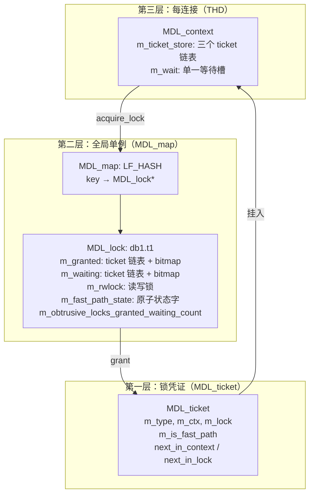
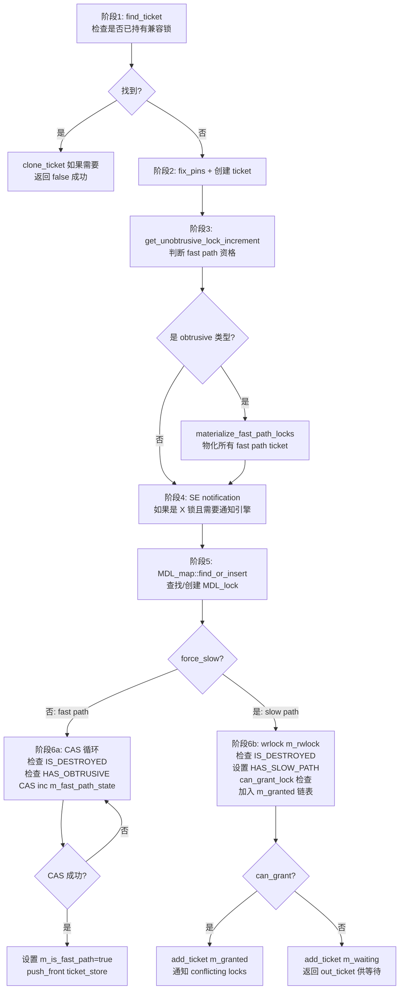
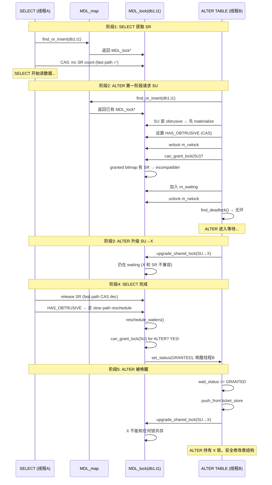

# MySQL MDL 源码深度剖析

> **源码基线：** MySQL 9.6.0 (trunk), `sql/mdl.h` 1750行 + `sql/mdl.cc` 4923行。
>
> **解决什么问题：** 保护数据库元数据（表结构、schema、存储过程等）在并发访问下的一致性。DDL 不能和 DML 同时跑在同一张表上，MDL 就是这个互斥机制的实现。
>
> **并发安全吗？** MDL 采用三层并发保护：Lock-Free 哈希表做全局查找、读写锁保护链表操作、原子 CAS 实现高性能 fast path。有死锁检测机制，但不保证完全无死锁——牺牲品回滚策略解决已发生的死锁。

---

## 一、核心数据结构与内存布局

### 1.1 MDL 三层架构



**三个对象的生命周期：**

| 对象 | 分配 | 释放 | 所属 |
|------|------|------|------|
| MDL_request | 调用者栈/MEM_ROOT | 调用者决定 | 调用者 |
| MDL_ticket | MDL 内部 MEM_ROOT | 锁释放时 | MDL_context |
| MDL_lock | MDL_map（全局哈希） | 引用计数归零 | 全局单例 |

### 1.2 MDL_key：定长 387 字节的身份编码

```cpp
// MySQL 9.6.0, sql/mdl.h:366-791
struct MDL_key {
  uint16 m_length{0};               // 有效字节数
  uint16 m_db_name_length{0};       // 数据库名长度
  uint16 m_object_name_length{0};   // 对象名长度
  char m_ptr[MAX_MDLKEY_LENGTH]{0}; // 387字节定长 buffer
};
// MAX_MDLKEY_LENGTH = 1 + NAME_LEN + 1 + NAME_LEN + 1 = 1 + 3*64 + 1 + 3*64 + 1
// 387 字节，UTF8MB3 编码下最坏情况
```

**内存布局（以 TABLE `test.t1` 为例）：**

```
m_ptr[0]     = 0x04  (TABLE)
m_ptr[1..5]  = "test" + '\0'
m_ptr[6]     = '\0'
m_ptr[7..9]  = "t1" + '\0'
→ m_length = 10, m_db_name_length = 4
```

**19 种命名空间** (`enum_mdl_namespace`, sql/mdl.h:402-424):

```
GLOBAL(0), BACKUP_LOCK, TABLESPACE, SCHEMA, TABLE, FUNCTION,
PROCEDURE, TRIGGER, EVENT, COMMIT, USER_LEVEL_LOCK, LOCKING_SERVICE,
SRID, ACL_CACHE, COLUMN_STATISTICS, RESOURCE_GROUPS, FOREIGN_KEY, 
CHECK_CONSTRAINT, LIBRARY, NAMESPACE_END
```

**关键设计：** `m_ptr` 是定长 buffer，意味着 MDL_key 可以放在栈上、可以 memcmp 快速比较、可以作为哈希 key。`mdl_key_init()` 有 4 个重载：普通对象、带列名的对象、归一化名称对象（FUNCTION/PROCEDURE/EVENT）、从 partial key 还原。

### 1.3 MDL_ticket：锁凭证的双向链表节点

```cpp
// MySQL 9.6.0, sql/mdl.h:988-1112
class MDL_ticket : public MDL_wait_for_subgraph {
  MDL_ticket *next_in_context;     // context 链表前驱
  MDL_ticket **prev_in_context;    // context 链表后继
  MDL_ticket *next_in_lock;        // lock 链表前驱
  MDL_ticket **prev_in_lock;       // lock 链表后继

  enum_mdl_type m_type;            // 锁类型
  MDL_context *m_ctx;              // 所属连接
  MDL_lock *m_lock;                // 所属 MDL_lock
  bool m_is_fast_path;             // 是否走 fast path
  bool m_hton_notified;            // 是否已通知存储引擎
};
```

**一个 ticket 同时在两个链表上：**

```
MDL_context::m_ticket_store                 MDL_lock::m_granted
  [t1] ↔ [t2] ↔ [t3]                          [tA] ↔ [tB] ↔ ...
  ↑ context 链表（按 duration 分三段）       ↑ lock granted 链表
  
                                             MDL_lock::m_waiting
                                               [tC] ↔ [tD] ↔ ...
                                               ↑ lock waiting 链表
```

**ticket 内部由 `MDL_ticket::create()` 分配在 MEM_ROOT 上。** 锁释放时由 `MDL_ticket::destroy()` 归还。

### 1.4 MDL_lock：全局单例锁对象

```cpp
// MySQL 9.6.0, sql/mdl.cc:430-569
class MDL_lock {
  MDL_key key;                    // 锁保护的对象
  mysql_prlock_t m_rwlock;        // 保护 granted/waiting 链表的读写锁
  Ticket_list m_granted;          // 已授予的 ticket 链表 + bitmap
  Ticket_list m_waiting;          // 等待中的 ticket 链表 + bitmap
  fast_path_state_t m_fast_path_state;  // 原子状态字（见下文）
  
  // 两种并发策略：
  struct MDL_lock_strategy {
    bitmap_t m_granted_incompatible[MDL_TYPE_END];      // 授予矩阵
    bitmap_t m_waiting_incompatible[4][MDL_TYPE_END];   // 4组等待优先级矩阵
    fast_path_state_t m_unobtrusive_lock_increment[MDL_TYPE_END]; // fast path 增量
    bool m_is_affected_by_max_write_lock_count;
  };
};
```

**m_fast_path_state 原子状态字的位布局：**

```
bit 0:    HAS_SLOW_PATH    (是否有 slow path ticket)
bit 1:    HAS_OBTRUSIVE    (是否有 obtrusive 锁请求/持有)
bit 2:    IS_DESTROYED     (对象是否已被标记删除)
bit 3-15: SR count         (MDL_SHARED_READ 的 fast path 计数)
bit 16-28: SW count        (MDL_SHARED_WRITE 的 fast path 计数)  
bit 29-41: S count         (MDL_SHARED 的 fast path 计数)
bit 42-54: SH count        (MDL_SHARED_HIGH_PRIO 的 fast path 计数)

typedef longlong fast_path_state_t;  // 64位，足以容纳
```

**一个 64 位整数同时编码了：** 标志位 + 4 种锁类型的引用计数。这就是 fast path 不需要链表操作的根本原因——CAS 一次原子操作同时完成了"检查是否允许"和"更新计数"。

---

## 二、10 种锁类型的双向兼容矩阵与优先级系统

### 2.1 锁类型定义

```cpp
// MySQL 9.6.0, sql/mdl.h:197-330
enum enum_mdl_type {
  MDL_INTENTION_EXCLUSIVE = 0,   // IX: 意向排他（scoped locks）
  MDL_SHARED,                    // S:  共享元数据锁
  MDL_SHARED_HIGH_PRIO,          // SH: 高优先级共享（忽略 X 等待）
  MDL_SHARED_READ,               // SR: 共享读（SELECT 用）
  MDL_SHARED_WRITE,              // SW: 共享写（DML 用）
  MDL_SHARED_WRITE_LOW_PRIO,     // SWLP: 低优先级 SW
  MDL_SHARED_UPGRADABLE,         // SU: 可升级共享（ALTER 第一阶段）
  MDL_SHARED_READ_ONLY,          // SRO: 只读共享（LOCK TABLES READ）
  MDL_SHARED_NO_WRITE,           // SNW: 禁止写（ALTER 复制数据阶段）
  MDL_SHARED_NO_READ_WRITE,      // SNRW: 禁止读写（LOCK TABLES WRITE）
  MDL_EXCLUSIVE,                 // X: 排他（CREATE/DROP/RENAME）
  MDL_TYPE_END
};
```

### 2.2 授予兼容矩阵（二维 bitmap）

```cpp
// MySQL 9.6.0, sql/mdl.cc: 在 MDL_object_lock / MDL_scoped_lock 构造函数中初始化
// 矩阵含义：m_granted_incompatible[请求类型] = bitmap(与之不兼容的已授予类型集)
//
// 示例：请求 X 锁时，所有已授予锁都不兼容：
//   m_granted_incompatible[X] = MDL_BIT(IX)|MDL_BIT(S)|...|MDL_BIT(X)
//
// 请求 SR 锁时，只有 SU/SRO/SNW/SNRW/X 不兼容：
//   m_granted_incompatible[SR] = MDL_BIT(SU)|MDL_BIT(SRO)|MDL_BIT(SNW)|MDL_BIT(SNRW)|MDL_BIT(X)

#define MDL_BIT(A) static_cast<MDL_lock::bitmap_t>(1U << A)
```

**授予兼容矩阵（`+` = 兼容, `-` = 不兼容）：**

```
            IX  S  SH  SR  SW SWLP SU SRO SNW SNRW X
IX          +   +   +   +   +   +   +   +   +   +   -
S           +   +   +   +   +   +   +   +   +   -   -
SH          +   +   +   +   +   +   +   +   +   -   -
SR          +   +   +   +   +   +   -   -   -   -   -
SW          +   +   +   +   +   +   -   -   -   -   -
SWLP        +   +   +   +   +   +   -   -   -   -   -
SU          +   +   +   -   -   -   -   -   -   -   -
SRO         +   +   +   -   -   -   -   -   -   -   -
SNW         +   +   +   -   -   -   -   -   -   -   -
SNRW        +   -   -   -   -   -   -   -   -   -   -
X           -   -   -   -   -   -   -   -   -   -   -
```

**锁强度升序：** IX < S < SH < SR = SW = SWLP < SU < SRO < SNW < SNRW < X

### 2.3 等待优先级矩阵（4 组，防止饥饿）

```cpp
// MySQL 9.6.0, sql/mdl.cc: 每个 MDL_lock_strategy 构造函数
// m_waiting_incompatible[0] — 正常情况
// m_waiting_incompatible[1] — piglet 计数超限
// m_waiting_incompatible[2] — hog 计数超限
// m_waiting_incompatible[3] — 两者均超限

// "piglet" = SW 类型请求（在 waiting 队列中低优先）
// "hog"    = SU/SNW/SNRW 类型请求（在 waiting 队列中高优先）
// max_write_lock_count = sysvar: max_write_lock_count (默认值 ~4294967295)

bool MDL_lock::is_affected_by_max_write_lock_count() const {
  // 当 piglet 或 hog 连续授予次数超过 max_write_lock_count 时
  // 切换到更高优先级的 waiting_incompatible 矩阵
  // 给 waiting 中的相反类型让路
}
```

**关键设计理念：** 如果有大量 SW（DML）在等待队列中因为 SU（ALTER）请求而无法被授予，当 SW 被连续跳过超过阈值时，系统切换到矩阵[1]，让 SW 优先级更高，防止 DML 饥饿。

---

## 三、锁获取完整代码路径

### 3.1 try_acquire_lock_impl 的完整六阶段流程

```cpp
// MySQL 9.6.0, sql/mdl.cc:2813-3141
bool MDL_context::try_acquire_lock_impl(MDL_request *mdl_request,
                                        MDL_ticket **out_ticket) {
```



**阶段 5 的 find_or_insert 使用 LF_HASH：**

```cpp
// MySQL 9.6.0, sql/mdl.cc:2932
if (!(lock = mdl_locks.find_or_insert(m_pins, key, &pinned))) {
  // 失败处理：清理 ticket + SE 通知
  return true;
}
// pinned=true: 新创建的对象，需要 unpin
// pinned=false: 单例对象 (GLOBAL/COMMIT/ACL_CACHE)，不需要 pin
```

**阶段 6a 的 CAS 循环（fast path 核心，代码 2972-3015）：**

```cpp
// MySQL 9.6.0, sql/mdl.cc:2973-3015
MDL_lock::fast_path_state_t old_state = lock->m_fast_path_state;
bool first_use;

do {
    // 检查 1: 对象是否已被标记删除
    if (old_state & MDL_lock::IS_DESTROYED) {
        if (pinned) lf_hash_search_unpin(m_pins);
        goto retry;  // 重新查找
    }
    
    // 检查 2: 是否有 obtrusive 锁（如果有，必须走 slow path）
    if (old_state & MDL_lock::HAS_OBTRUSIVE) goto slow_path;
    
    // 检查 3: 这是否是首次使用（全 0 状态）
    first_use = (old_state == 0);
    
    // 原子 CAS：尝试将计数器增加 unobtrusive_lock_increment
    // 如果 old_state 在读取后被其他线程修改了，CAS 失败 → 重试循环
} while (!lock->fast_path_state_cas(
    &old_state, old_state + unobtrusive_lock_increment));

// CAS 成功！锁已获取。不需要持有任何锁。
if (pinned) lf_hash_search_unpin(m_pins);
ticket->m_lock = lock;
ticket->m_is_fast_path = true;
m_ticket_store.push_front(mdl_request->duration, ticket);
```

**这段代码的精妙之处：** CAS 操作本身既做"是否允许"的检查又做"获取"的动作。`HAS_OBTRUSIVE` 标志位在 CAS 中被同时检查——如果有 obtrusive 请求，CAS 自动失败，fall through 到 slow path。

**阶段 6b 的 slow path（代码 3048-3141）：**

```cpp
// MySQL 9.6.0, sql/mdl.cc:3048-3141
slow_path:
  mysql_prlock_wrlock(&lock->m_rwlock);    // 获取写锁
  
  // 再次检查 IS_DESTROYED（在写锁保护下）
  MDL_lock::fast_path_state_t state = lock->m_fast_path_state;
  if (state & MDL_lock::IS_DESTROYED) {
      mysql_prlock_unlock(&lock->m_rwlock);
      goto retry;
  }
  
  // unpin 后仍可安全访问（因为持有 m_rwlock）
  if (pinned) lf_hash_search_unpin(m_pins);
  
  // 如果是第一个 obtrusive 锁，原子设置 HAS_OBTRUSIVE 标志
  const bool first_obtrusive_lock =
      (unobtrusive_lock_increment == 0) &&
      ((lock->m_obtrusive_locks_granted_waiting_count++) == 0);
  
  // 原子设置 HAS_SLOW_PATH 和 HAS_OBTRUSIVE（如果需要）
  if (!(state & MDL_lock::HAS_SLOW_PATH) || first_obtrusive_lock) {
      do {
          first_use = (state == 0);
      } while (!lock->fast_path_state_cas(
          &state, state | MDL_lock::HAS_SLOW_PATH |
                  (first_obtrusive_lock ? MDL_lock::HAS_OBTRUSIVE : 0)));
  }
  
  ticket->m_lock = lock;
  
  // 核心判定：用 bitmap 检查请求类型是否与 granted 集合兼容
  if (lock->can_grant_lock(mdl_request->type, this)) {
      lock->m_granted.add_ticket(ticket);     // 加入 granted 链表
      // 处理 piglet/hog 计数（防止饥饿）
      if (lock->is_affected_by_max_write_lock_count()) { ... }
      // 通知 conflict 的锁持有者
      if (lock->needs_notification(ticket))
          lock->notify_conflicting_locks(this);
      mysql_prlock_unlock(&lock->m_rwlock);
      m_ticket_store.push_front(...);
      return false;
  }
  
  // 不能授予：加入 waiting 队列，返回 ticket 供 acquire_lock() 等待
  lock->m_waiting.add_ticket(ticket);
  mysql_prlock_unlock(&lock->m_rwlock);
  *out_ticket = ticket;
  return false;  // false = 无错误，但需要等待
```

### 3.2 can_grant_lock 的 bitmap 判定

```cpp
// 伪代码（实际在 MDL_lock 的子类中根据策略实现）：
bool can_grant_lock(enum_mdl_type type, MDL_context *ctx) {
    // 检查 1: 请求类型是否与已授予的锁集合不冲突
    if (m_granted.bitmap() & m_strategy.m_granted_incompatible[type])
        return false;  // 有已授予的不兼容锁
    
    // 检查 2: 请求类型是否比等待队列中的请求优先级更高
    // （使用当前的 waiting_incompatible 矩阵组）
    int matrix_group = get_current_waiting_incompatible_index();
    if (m_waiting.bitmap() & m_strategy.m_waiting_incompatible[matrix_group][type])
        return false;  // 有更高优先级的等待者
    
    return true;
}
```

**m_granted_incompatible 是一个 bitmap 数组**，其中 `m_granted_incompatible[请求类型]` 的每一位代表一种不能与请求类型共存的已授予锁类型。检查方式是位与操作——O(1)。

### 3.3 acquire_lock 的等待循环

```cpp
// MySQL 9.6.0, sql/mdl.cc:3364-3597（简化关键路径）
bool MDL_context::acquire_lock(MDL_request *mdl_request, 
                               Timeout_type lock_wait_timeout) {
    // timeout==0 走 try_acquire_lock（不需要死锁检测）
    if (lock_wait_timeout == 0) { ... }
    
    // 尝试无等待获取
    if (try_acquire_lock_impl(mdl_request, &ticket)) return true;
    if (mdl_request->ticket) return false;  // 无等待成功
    
    // === 加入等待队列 ===
    lock = ticket->m_lock;
    lock->m_waiting.add_ticket(ticket);
    m_wait.reset_status();
    lock->notify_conflicting_locks(this);  // 通知冲突的锁持有者
    mysql_prlock_unlock(&lock->m_rwlock);
    
    // === 死锁检测 ===
    // 优化：ACL_CACHE S 锁 + 无 commit order wait → 延迟 1 秒检测
    if (lock->key.mdl_namespace() != MDL_key::ACL_CACHE || ...)
        find_deadlock();
    
    // === 等待循环 ===
    // 如果需要 notification 或 connection check，先短等再通知
    if (lock->needs_notification(ticket) || lock->needs_connection_check()) {
        struct timespec abs_shortwait;
        set_timespec(&abs_shortwait, 1);  // 1 秒短等待
        while (cmp_timespec(&abs_shortwait, &abs_timeout) <= 0) {
            wait_status = m_wait.timed_wait(m_owner, &abs_shortwait, false, ...);
            if (wait_status != MDL_wait::WS_EMPTY) break;
            // 重新通知 conflicting locks
            lock->notify_conflicting_locks(this);
            set_timespec(&abs_shortwait, 1);
        }
    }
    if (wait_status == MDL_wait::WS_EMPTY)
        wait_status = m_wait.timed_wait(m_owner, &abs_timeout, true, ...);
    
    // === 结果处理 ===
    if (wait_status != MDL_wait::GRANTED) {
        lock->remove_ticket(this, m_pins, &MDL_lock::m_waiting, ticket);
        // VICTIM → ER_LOCK_DEADLOCK / TIMEOUT → ER_LOCK_WAIT_TIMEOUT
        // KILLED → ER_QUERY_INTERRUPTED
        return true;
    }
    
    // 被授予：由 reschedule_waiters 更新了 MDL_lock 状态
    // 只需更新 context 和 request
    m_ticket_store.push_front(mdl_request->duration, ticket);
    mdl_request->ticket = ticket;
    return false;
}
```

---

## 四、死锁检测的 DFS 算法

### 4.1 死锁检测的触发时机

死锁检测在**每次线程进入等待队列后**立即执行。不是定时任务，不是后台线程——是每个等待者自己触发的。

### 4.2 等待图的定义

```cpp
// MySQL 9.6.0, sql/mdl.h:949-987
class MDL_wait_for_subgraph {
  // 抽象方法：返回等待图中本节点的所有出边（目标 context）
  virtual bool accept_visitor(MDL_wait_for_graph_visitor *visitor) = 0;
};

// MDL_ticket 实现：
// 对于本 ticket 持有的锁，在 waiting 队列中找不兼容的请求者
// 那些请求者的 context 就是等待图的出边目标
```

**等待图构建逻辑（简化）：**

```
线程 A 请求 db1.t1 的 X 锁 → 在 waiting 中
线程 B 持有 db1.t1 的 SR 锁 → 在 granted 中，与 X 不兼容
→ 等待边：A → B（A 等待 B 释放）

线程 B 请求 db1.t2 的 X 锁 → 在 waiting 中
线程 A 持有 db1.t2 的 SR 锁 → 在 granted 中，与 X 不兼容
→ 等待边：B → A（B 等待 A 释放）

→ 形成环 A→B→A = 死锁！
```

### 4.3 Deadlock_detection_visitor 的完整代码

```cpp
// MySQL 9.6.0, sql/mdl.cc:294-410
class Deadlock_detection_visitor : public MDL_wait_for_graph_visitor {
  MDL_context *m_start_node;        // 检测发起者
  MDL_context *m_victim;            // 当前选中的牺牲品
  uint m_current_search_depth;      // 当前 DFS 深度
  bool m_found_deadlock;            // 是否发现死锁
  static const uint MAX_SEARCH_DEPTH = 32;  // 硬上限
};

// === 进入节点 ===
bool Deadlock_detection_visitor::enter_node(MDL_context *node) {
    // 深度超过 32 层 → 直接判定为死锁（防止栈溢出）
    m_found_deadlock = ++m_current_search_depth >= MAX_SEARCH_DEPTH;
    if (m_found_deadlock) {
        opt_change_victim_to(node);  // 选当前节点为牺牲品
    }
    return m_found_deadlock;
}

// === 检查边 ===
bool Deadlock_detection_visitor::inspect_edge(MDL_context *node) {
    // 发现环：目标节点就是起始节点
    m_found_deadlock = (node == m_start_node);
    return m_found_deadlock;
}

// === 离开节点 ===
void Deadlock_detection_visitor::leave_node(MDL_context *node) {
    --m_current_search_depth;
    // 如果发现了死锁，在回溯时更新牺牲品选择
    if (m_found_deadlock) opt_change_victim_to(node);
}

// === 牺牲品选择 ===
void Deadlock_detection_visitor::opt_change_victim_to(MDL_context *new_victim) {
    // 选权重最低的作为牺牲品
    if (m_victim == nullptr ||
        m_victim->get_deadlock_weight() >= new_victim->get_deadlock_weight()) {
        MDL_context *tmp = m_victim;
        m_victim = new_victim;
        m_victim->lock_deadlock_victim();    // 标记为受害者
        if (tmp) tmp->unlock_deadlock_victim(); // 释放旧受害者
    }
}
```

### 4.4 find_deadlock 的循环检测

```cpp
// MySQL 9.6.0, sql/mdl.cc:4049-4089
void MDL_context::find_deadlock() {
    while (true) {
        Deadlock_detection_visitor dvisitor(this);
        MDL_context *victim;
        
        // 从 this 开始 DFS 遍历等待图
        if (!visit_subgraph(&dvisitor)) {
            break;  // 未发现死锁
        }
        
        // 发现死锁：选择牺牲品
        victim = dvisitor.get_victim();
        
        // 设置牺牲品状态为 VICTIM（原子操作）
        (void)victim->m_wait.set_status(MDL_wait::VICTIM);
        victim->unlock_deadlock_victim();
        
        if (victim == this) break;
        
        // 继续循环：因为杀死一个牺牲品后可能还有其他环
        // 需要确保所有环都被打破
    }
}
```

**为什么需要 while 循环？** 杀死一个牺牲品打破了一个环，但如果等待图中存在多个环，还需要继续检测。只有当 `visit_subgraph` 找不到任何环时才退出。

### 4.5 死锁权重计算

```cpp
// MySQL 9.6.0, sql/mdl.h:1024
uint MDL_ticket::get_deadlock_weight() const {
    // 权重越低 → 越容易被选为牺牲品
    // 考虑因素：
    // 1. 锁类型：持有轻量锁（SR/SW）的比持有重量锁（X）的更容易被选
    // 2. 等待中的 vs 已授予的：等待中的比已授予的更容易被选
    // 3. commit order wait：有 commit order wait 的不容易被选
    // （具体实现在 MDL_context::get_deadlock_weight()）
}
```

---

## 五、Fast Path 物化（Materialization）

### 5.1 触发条件

```cpp
// MySQL 9.6.0, sql/mdl.cc:2900
if (!unobtrusive_lock_increment) materialize_fast_path_locks();
```

**物化在以下情况触发：**
1. 请求 obtrusive 类型的锁（SU/SRO/SNW/SNRW/X/IX 等）
2. 连接有 open HANDLER（`m_needs_thr_lock_abort == true`）

### 5.2 物化过程

```cpp
// 伪代码，实际在 MDL_context::materialize_fast_path_locks()
void materialize_fast_path_locks() {
    // 遍历本 context 的 ticket_store 中所有 STATEMENT duration 的 ticket
    // 对每个 m_is_fast_path==true 的 ticket：
    //   1. acquire m_rwlock (write lock)
    //   2. 将 ticket 从 fast_path_state 计数器减去
    //   3. 将 ticket 加入 MDL_lock::m_granted 链表
    //   4. 设置 m_is_fast_path = false
    //   5. release m_rwlock
}
```

**为什么需要物化？** obtrusive 锁需要遍历 granted 链表来检查兼容性——如果部分 ticket 还在 fast path 计数器里，链表检查会漏掉它们。

---

## 六、锁释放与等待者调度

### 6.1 Fast path 释放

```cpp
// MySQL 9.6.0, sql/mdl.cc:4125-4148（简化）
if (ticket->m_is_fast_path) {
    // 原子递减 fast_path_state
    // 如果 HAS_OBTRUSIVE 被设置 → 需要走 slow path 释放
    //   （因为可能有 waiting 请求需要被唤醒）
    lock->fast_path_state_cas(&old_state, 
                              old_state - unobtrusive_lock_increment);
    // 检查是否需要 reschedule:
    if (old_state & MDL_lock::HAS_OBTRUSIVE) {
        mysql_prlock_wrlock(&lock->m_rwlock);
        lock->reschedule_waiters();
        mysql_prlock_unlock(&lock->m_rwlock);
    }
}
```

### 6.2 Slow path 释放 + reschedule_waiters

```cpp
// reschedule_waiters() 核心逻辑
void MDL_lock::reschedule_waiters() {
    // 遍历 waiting 队列
    for each ticket in m_waiting {
        // 检查 can_grant_lock(ticket->type, ticket->ctx)
        if (can_grant_lock(ticket->type, ticket->ctx)) {
            // 从 waiting 移除，加入 granted
            m_waiting.remove_ticket(ticket);
            m_granted.add_ticket(ticket);
            // 唤醒等待的线程
            ticket->m_ctx->m_wait.set_status(MDL_wait::GRANTED);
        } else {
            break;  // FIFO 顺序：一旦遇到不能授予的，后面的也不授予
        }
    }
}
```

**关键约束：** waiting 队列按 FIFO 处理。不允许跳过前面的请求去授予后面的——这防止了饥饿。`can_grant_lock` 中 waiting_incompatible 矩阵已经通过 piglet/hog 优先级机制处理了公平性问题。

---

## 七、实战时序：SELECT 遇到 ALTER TABLE



---

## 八、关键要点速查

1. **三层架构：** ticket（每锁）→ MDL_lock（每对象）→ MDL_map（全局哈希）

2. **Fast path 是 99% 操作的路径：** SR/SW/S/SH 四种锁走 CAS 原子递增，不需要链表操作。只有 obtrusive 锁（SU 以上）或 HANDLER 场景才走 slow path。

3. **m_fast_path_state 的 CAS 循环同时做"检查"和"获取"：** 一次原子 compare-and-swap 检查 IS_DESTROYED、HAS_OBTRUSIVE，并递增计数。失败就重试或 fall through 到 slow path。

4. **死锁检测是被动触发的：** 每次进入 waiting 队列时执行，不是后台轮询。DFS 深度上限 32 层（超过即判死锁）。

5. **牺牲品选权重最低的：** 持有轻量锁、等待时间长的更容易被牺牲。VICTIM 在线程的 `m_wait` 状态槽中设置，牺牲品自己检查状态后回滚。

6. **4 组等待优先级矩阵防止饥饿：** piglet 计数超限时提升 SW 优先级，hog 计数超限时提升 SU/SNW/SNRW 优先级。由 `max_write_lock_count` 系统变量控制。

7. **读写锁偏向读者：** 死锁检测持有读锁遍历，即使有写锁等待也不会被阻塞。这防止了"死锁检测器自己死锁"。

8. **MDL_lock 的引用计数隐式管理：** fast path 计数器 + granted/waiting 链表元素数 > 0 → 对象存活。归零 → 从哈希表删除。
