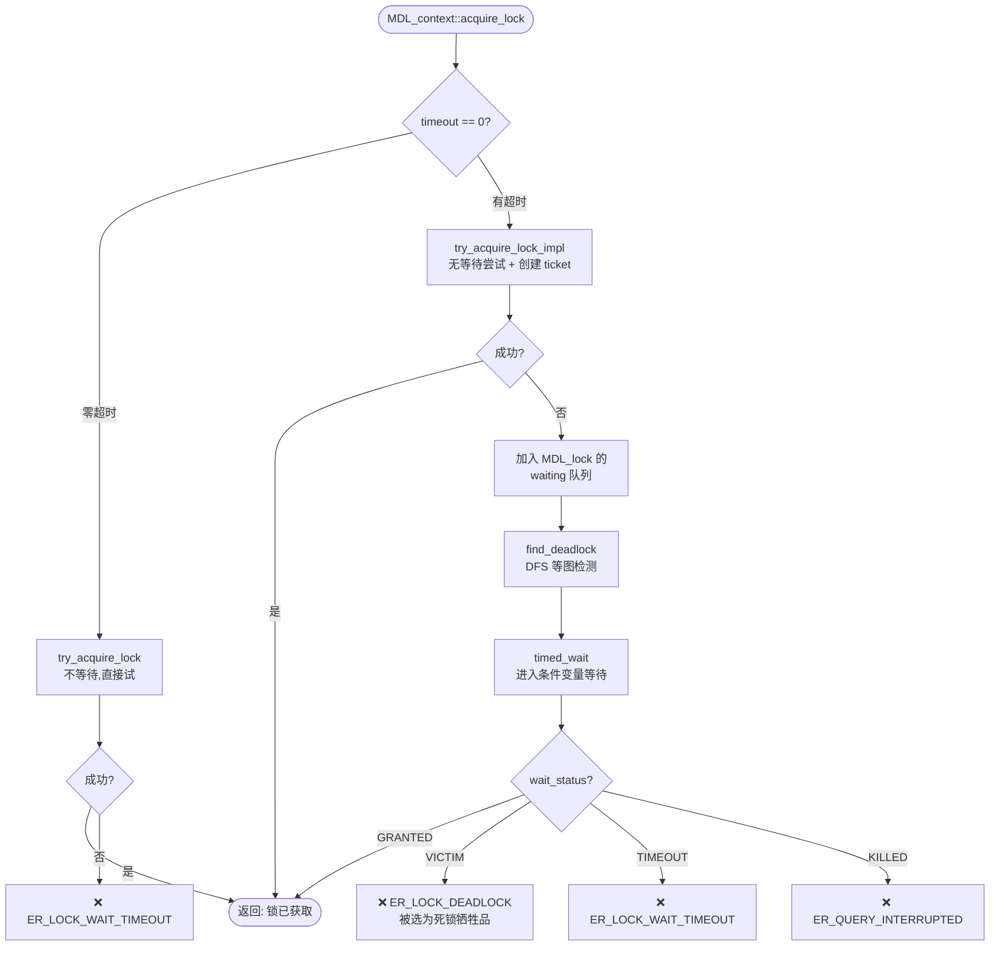
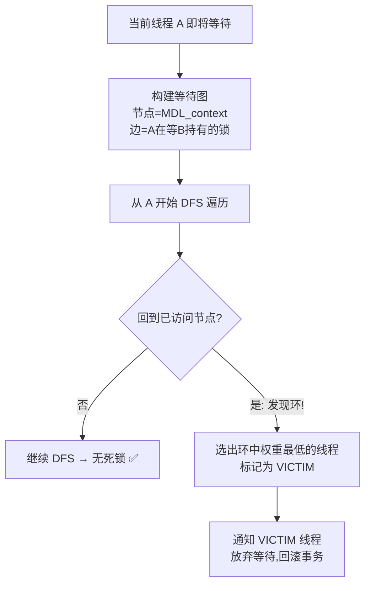
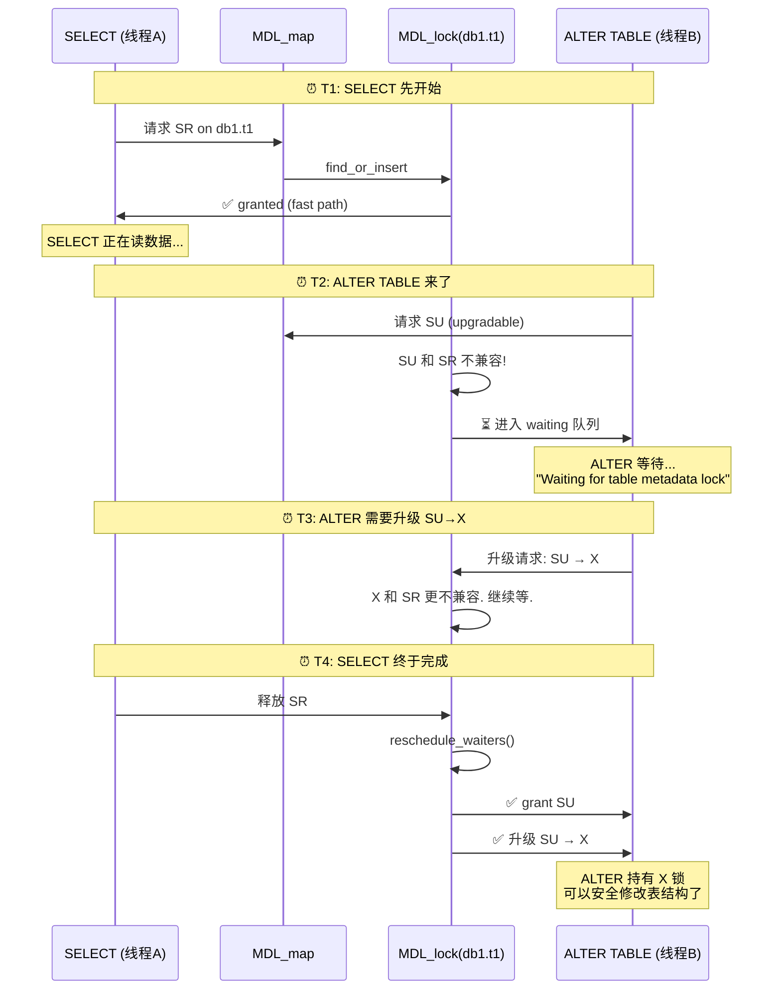

# MySQL MDL 入门到精通：Metadata Lock 的获取、等待与死锁

> **一句话理解 MDL：** MDL（Metadata Lock）是 MySQL 的"表结构锁"——它确保你在读数据（SELECT）时，别人不能同时改表结构（ALTER TABLE）。它是 DDL 和 DML 之间的仲裁者。

**读者定位：** 熟悉 MySQL 但不一定读过 MDL 源码。读完本文你将理解：MDL 锁类型图谱、锁获取流程、死锁检测原理、以及 `Waiting for table metadata lock` 这个经典报错背后的故事。

---

## 目录

1. [为什么需要 MDL？](#1-为什么需要-mdl)
2. [10 种锁类型速查](#2-10-种锁类型速查)
3. [锁获取全流程](#3-锁获取全流程)
4. [Fast Path：为什么 MDL 不拖慢你的查询](#4-fast-path为什么-mdl-不拖慢你的查询)
5. [死锁检测](#5-死锁检测)
6. [实战：SELECT 和 ALTER TABLE 的对决](#6-实战select-和-alter-table-的对决)
7. [实战排查手册](#7-实战排查手册)
8. [常见坑与 FAQ](#8-常见坑与-faq)

---

## 1. 为什么需要 MDL？

想象这个场景：

```
时间线  线程 A (SELECT)              线程 B (ALTER TABLE)
─────────────────────────────────────────────────────────
T1      打开表 t1，开始读数据...
T2                                   删除列 col_3
T3      读到第 100 行                 ALTER 完成
T4      尝试读 col_3 → 💥 崩溃！
```

线程 A 打开表时 t1 有 10 列，读到一半时线程 B 删除了 col_3——线程 A 的表结构视图和磁盘上的实际结构不一致了。

**MDL 做的事：** 在 T1 给线程 A 发一把"共享读锁"（SR），在 T2 线程 B 申请"排他锁"（X）时被阻塞——直到线程 A 释放 SR。这样线程 A 的整个读过程看到的是同一个表结构。

---

## 2. 10 种锁类型速查

### 2.1 兼容矩阵

```
            IX  S  SH  SR  SW SWLP SU SRO SNW SNRW X
IX          +   +   +   +   +   +   +   +   +   +   -
S           +   +   +   +   +   +   +   +   +   -   -
SH          +   +   +   +   +   +   +   +   +   -   -
SR          +   +   +   +   +   +   -   -   -   -   -
SW          +   +   +   +   +   +   -   -   -   -   -
SU          +   +   +   -   -   -   -   -   -   -   -
SRO         +   +   +   -   -   -   -   -   -   -   -
SNW         +   +   +   -   -   -   -   -   -   -   -
SNRW        +   -   -   -   -   -   -   -   -   -   -
X           -   -   -   -   -   -   -   -   -   -   -
```

`+` = 兼容（可同时持有），`-` = 冲突（后来的必须等待）

**锁强度升序：** IX < S < SH < SR < SW < SU < SRO < SNW < SNRW < X

### 2.2 常见操作用什么锁？

| 操作 | 锁类型 | 说明 |
|---|---|---|
| SELECT（普通） | SR (Shared Read) | 允许并发读，阻止 DDL |
| INSERT/UPDATE/DELETE | SW (Shared Write) | 允许并发读写，阻止 DDL |
| SELECT ... FOR UPDATE | SR + InnoDB 行锁 | 仍然是 SR，行锁在 InnoDB 层 |
| LOCK TABLES t1 READ | S (Shared) | 更强的共享锁 |
| ALTER TABLE（第一阶段） | SU (Shared Upgradeable) | 允许读，阻止写——准备升级到 X |
| ALTER TABLE（最后阶段） | X (Exclusive) | 排他——谁也别碰这张表 |
| DROP TABLE | X | 彻底独占 |

### 2.3 三种锁时长

| 时长 | 释放时机 | 典型场景 |
|---|---|---|
| STATEMENT | 语句结束 | 大部分普通 DML |
| TRANSACTION | COMMIT/ROLLBACK | 事务中打开的表 |
| EXPLICIT | 手动 release_lock() | LOCK TABLES、备份工具 |

---

## 3. 锁获取全流程



**六个阶段拆解：**

| 阶段 | 做什么 | 关键函数 |
|---|---|---|
| 1. 零超时快速路径 | timeout=0 时直接 try，失败就报错 | `try_acquire_lock()` |
| 2. 无等待尝试 | 尝试获取锁，即使失败也创建 ticket | `try_acquire_lock_impl()` |
| 3. 入等待队列 | ticket 挂到 MDL_lock 的 waiting 链表 | `m_waiting.add_ticket()` |
| 4. 死锁检测 | 构图 → DFS → 选牺牲品 | `find_deadlock()` |
| 5. 条件等待 | 线程睡在 condition variable 上等唤醒 | `timed_wait()` |
| 6. 结果处理 | GRANTED=挂入 ticket_store / VICTIM/TIMEOUT=清理+报错 | `push_front()` |

> 📌 源码位置：`MySQL 9.6.0, sql/mdl.cc:3364` `MDL_context::acquire_lock()`

---

## 4. Fast Path：为什么 MDL 不拖慢你的查询

**这是 MDL 最重要的性能设计。** 绝大多数 DML 操作（99%+）的 MDL 请求走 fast path——零链表操作，零等待队列检查，零死锁检测。

### 4.1 哪些锁走 fast path？

四种轻量锁：
- `MDL_SHARED` (S)
- `MDL_SHARED_HIGH_PRIO` (SH)
- `MDL_SHARED_READ` (SR) ← SELECT 就用这个
- `MDL_SHARED_WRITE` (SW) ← INSERT/UPDATE/DELETE 用这个

### 4.2 Fast Path 怎么工作？

```
正常路径（slow path）:                Fast Path:
─────────────────────                ─────────
创建 ticket                          只 inc 原子计数器
挂入 MDL_lock.granted 链表           不需要创建 ticket!
检查兼容矩阵                          
检查 waiting 队列                     

→ 需要 MDL_lock 的读写锁             → 只需要原子操作
```

**实际的 CAS 循环比"计数器++"复杂得多。** 一次 CAS 同时完成三个检查：

```cpp
// MySQL 9.6.0, sql/mdl.cc:2900（简化）
// m_fast_path_state 的位布局：
//   [高位: 3组计数器] [低位: 3个状态位]
//   状态位: HAS_SLOW_PATH | HAS_OBTRUSIVE | IS_DESTROYED

bool try_acquire_lock_impl(MDL_request *req, MDL_ticket **out_ticket) {
    uint64 old_state, new_state;
    do {
        old_state = lock->m_fast_path_state.load();
        
        // 检查 1: MDL_lock 是否已被标记为销毁？
        if (old_state & IS_DESTROYED) goto slow_path;
        
        // 检查 2: 是否有 obtrusive 锁在 waiting？
        if (old_state & HAS_OBTRUSIVE) goto slow_path;
        
        // 检查 3: 是否为 unobtrusive 锁类型（SR/SW/S/SH）？
        if (!is_unobtrusive_lock(req->type)) goto slow_path;
        
        // 计算新状态: 对应计数器 +1
        new_state = old_state + unobtrusive_lock_increment;
        
    } while (!lock->m_fast_path_state.compare_exchange_weak(old_state, new_state));
    // CAS 循环：失败就重试。只有当计数器值和状态位都等于 old_state 时才交换
    
    // CAS 成功 → fast path granted!
    return true;
    
slow_path:
    // 走传统路径：加写锁 → 检查兼容矩阵 → 入 granted 或 waiting
}
```

**三个检查决定了是否走 fast path：**
1. `IS_DESTROYED` — MDL_lock 即将被删除（引用计数归零），不能再用
2. `HAS_OBTRUSIVE` — 有重锁（SU 以上）在 waiting，fast path 先物化
3. 锁类型必须是 SR/SW/S/SH 之一

> 📌 源码位置：`MySQL 9.6.0, sql/mdl.cc:2813-3141`

### 4.3 Fast Path 什么时候"退化"？

当有一个 incompatible 的锁请求进入 waiting 队列时，所有 fast path ticket 必须"物化"（materialize）——补入 granted 链表。这样新来的重锁才能看到"有哪些轻锁挡在我前面"。

```
事件: ALTER TABLE 请求 SU 锁（与 SR 不兼容）
→ fast path SR ticket 全部物化到 granted 链表
→ ALTER 看到 granted 中的 SR ticket，确定自己必须等待
→ ALTER 进入 waiting 队列
```

---

## 5. 死锁检测

### 5.1 什么时候触发？

**每次线程准备进入等待队列时。** 检测发生在 `timed_wait()` 之前。

### 5.2 怎么检测？



### 5.3 死锁检测的 Visitor 模式

MDL 的死锁检测使用经典的 **Visitor 模式**——`Deadlock_detection_visitor` 遍历等待图的每个节点：

```cpp
// MySQL 9.6.0, sql/mdl.cc:294-410
class Deadlock_detection_visitor {
    static const uint MAX_SEARCH_DEPTH = 32;  // DFS 深度硬上限
    uint m_current_search_depth;
};

// 三步曲：
enter_node(node):    // 进节点 → depth++，超过 32 直接判死锁
inspect_edge(node):  // 查边 → 回到起点 = 发现环!
leave_node(node):    // 出节点 → depth--，回溯时更新牺牲品
```

**为什么上限是 32？** 防止恶意构造的深度等待链导致栈溢出。超过 32 层直接判定为死锁——这在实际场景中几乎不可能误判（正常的等待链不会超过 5-6 层）。

### 5.4 为什么是 while 循环？

```cpp
// MySQL 9.6.0, sql/mdl.cc:4049-4089
void MDL_context::find_deadlock() {
    while (true) {
        Deadlock_detection_visitor dvisitor(this);
        if (!visit_subgraph(&dvisitor)) break;  // 无环 → 退出
        
        victim = dvisitor.get_victim();
        victim->m_wait.set_status(MDL_wait::VICTIM);  // 杀死牺牲品
        
        if (victim == this) break;  // 自己被杀了 → 退出
        // 继续循环：打破一个环后，等图中可能还有其他环！
    }
}
```

**一次 kill 一个，直到无环为止。** 因为等图中可能有多个不相交的环——杀死一个牺牲品打破环 A，但环 B 可能仍然存在。

### 5.5 死锁示例

```
线程 A: 持有 db1.t1 的 SR 锁 → 现在请求 db1.t2 的 X 锁 → WAITING
线程 B: 持有 db1.t2 的 SR 锁 → 现在请求 db1.t1 的 X 锁 → WAITING

等图: A → B (A 等 B 释放 t2 的锁)
      B → A (B 等 A 释放 t1 的锁)
      形成环 → 死锁!

检测结果: 比较 A 和 B 的权重，选权重低的作为 VICTIM
```

### 5.6 谁会被选为 VICTIM？

权重计算考虑：
- **锁类型越强，权重越高**（持有 X 锁的不容易被牺牲——"他已经走到最后一步了"）
- **等待时间越长，权重越低**（等得久更容易被牺牲——"你已经等很久了，再等也没意义"）
- **有 commit order wait 的线程权重更高**（已经在等 binlog flush，再被牺牲会导致级联回滚）

选牺牲品策略：遍历环中所有节点，`opt_change_victim_to()` 比较权重，始终保留权重最低的。最终 `set_status(VICTIM)` 通知该线程，它自己醒来后回滚事务、释放持有的所有锁。

---

### 5.6 Piglet 与 Hog：等待优先级矩阵

**这不是死锁检测——这是防止饥饿的优先级调度机制。**

MDL 有 4 组等待优先级矩阵，用来决定"当有多个 waiting 请求时，谁先被授予"：

| 矩阵 | 触发条件 | 效果 |
|---|---|---|
| **正常优先级** | 默认 | 按 FIFO 顺序 |
| **Piglet 提升** | SW（写锁）waiting 数量 > `max_write_lock_count` | 提升 SW 的优先级——防止写入饥饿 |
| **Hog 提升** | SU/SNW/SNRW 等待超过阈值 | 提升重锁优先级——防止 DDL 被无限拖延 |
| **高优先级锁** | SH（高优先级共享）| 始终优先授予 |

```cpp
// MySQL 9.6.0, sql/mdl.cc:470-534
// waiting_incompatible 矩阵决定了：
// 一个 waiting 中的请求是否可以"插队"到 granted 中另一个请求前面
```

**实际效果：** 如果 100 个 SR 连续不断（一直有新的读请求），一个 waiting 的 SW 理论上会被永远阻塞。但当 waiting SW 数量超过 `max_write_lock_count`（默认值），piglet 机制提升 SW 优先级——新来的 SR 不再被授予，直到 SW 被唤醒。

DDL 同理：超过阈值后 hog 机制提升 SU/X 的优先级，防止 DDL 被 DML 洪流饿死。

> 📌 源码位置：`MySQL 9.6.0, sql/mdl.cc:470` `waiting_incompatible` 矩阵

---

## 6. 实战：SELECT 和 ALTER TABLE 的对决

这是最经典的 MDL 交互场景——也是 `Waiting for table metadata lock` 报错的根源。



**关键理解：** 
- 在 T2-T4 之间，**任何新的 SELECT 也能正常获取 SR**（因为 SR 和 waiting 的 SU 兼容）——所以读不阻塞
- 但 ALTER 必须等**所有已有的 SR 释放**后才能开始
- 如果有一个长事务（一直不释放 SR），ALTER 就永远等下去

---

## 7. 实战排查手册

### 8.1 快速定位：谁在等 MDL？

```sql
-- 一步到位：查看所有 MDL 等待关系
SELECT 
    waiting_pid AS '等待的进程',
    waiting_query AS '等待的 SQL',
    blocking_pid AS '阻塞者进程',
    blocking_query AS '阻塞者 SQL',
    wait_age AS '已等待时间'
FROM sys.schema_table_lock_waits;
```

### 8.2 深入排查：看锁详情

```sql
-- 某张表上的所有 MDL 锁
SELECT 
    OBJECT_TYPE, OBJECT_NAME,
    LOCK_TYPE, LOCK_DURATION, LOCK_STATUS,
    OWNER_THREAD_ID, OWNER_EVENT_ID
FROM performance_schema.metadata_locks
WHERE OBJECT_NAME = 't1'
ORDER BY OBJECT_NAME;
```

### 8.3 找出长事务（MDL 阻塞的常见根因）

```sql
-- 运行中超过 60 秒的事务——很可能持有 MDL 不放
SELECT 
    trx_id, trx_state, trx_started,
    TIMESTAMPDIFF(SECOND, trx_started, NOW()) AS '运行秒数',
    trx_mysql_thread_id,
    trx_query
FROM information_schema.innodb_trx
WHERE TIMESTAMPDIFF(SECOND, trx_started, NOW()) > 60;
```

### 8.4 紧急处理：KILL 阻塞的连接

```sql
-- 先找到阻塞者（从 sys.schema_table_lock_waits 获取 blocking_pid）
-- 然后杀掉它
KILL <blocking_pid>;

-- 如果 KILL 不生效（可能在等待 InnoDB 锁），用更强手段
KILL QUERY <blocking_pid>;  -- 先杀查询
-- 如果还不行，重启连接
```

---

## 8. 常见坑与 FAQ

### 🔴 坑 1：长事务阻塞 DDL

```sql
-- 会话 A: 开启事务后忘了关闭
BEGIN;
SELECT * FROM t1;  -- 获取 t1 的 SR (TRANSACTION 级别)
-- 去吃午饭了...

-- 会话 B:
ALTER TABLE t1 ADD COLUMN c4 INT;  
-- 💥 永远等待！A 不提交，SR 不释放
```

**预防措施：**
```sql
-- 设 DDL 等待超时（MySQL 8.0+）
SET SESSION lock_wait_timeout = 60;  -- 60 秒超时

-- 全局设置
SET GLOBAL lock_wait_timeout = 300;
```

### 🔴 坑 2：DDL 被 DML 洪流饿死

即使没有长事务，如果有持续不断的短事务（每秒 1000 个 SELECT），每个都获取瞬间的 SR，ALTER 可能一直等不到"所有 SR 都释放"的那个瞬间：

```
时间线:
T1: ALTER 请求 SU → waiting
T2: 100 个新 SELECT 获得 SR → ALTER 还在等
T3: 那 100 个释放 → 但瞬间又有 200 个新 SELECT 获得 SR
T4: 释放 → 新 SELECT → 释放 → 新 SELECT ...
T∞: ALTER 永远等不到"所有 SR 都释放"的那一刻
```

**这是 Piglet/Hog 机制存在的意义。** 当 waiting 中的重锁数量超过阈值，新来的 SR 不再被直接授予——给 ALTER 一个执行窗口。

**额外防护：**
```sql
-- 在低峰期执行 DDL
-- 或用 pt-online-schema-change（创建影子表 + 触发器 + 分批拷贝）
```

### 🔴 坑 3：INPLACE DDL 的 X 锁窗口

```sql
ALTER TABLE t1 ADD COLUMN c4 INT, ALGORITHM=INPLACE;
```

三阶段：
1. 获取 SU → 准备阶段（DML 继续 ✅）
2. **短暂升级到 X → 提交元数据变更**（所有 DML 阻塞 ❌）
3. 释放 X

虽然是"在线"DDL，但第 2 步有一个必须的 X 锁瞬间。高并发下这个瞬间可能导致大量连接堆积。

### 🔴 坑 4：MDL 与 InnoDB 锁的交互死锁

```sql
-- 会话 A
BEGIN;
UPDATE t1 SET c = 1 WHERE id = 1;  -- 持有 InnoDB 行锁
ALTER TABLE t2 ADD COLUMN c4 INT;  -- 请求 t2 的 SU → 等会话 B 的 t2 SR

-- 会话 B
BEGIN;
SELECT * FROM t2;                   -- 持有 t2 的 SR
UPDATE t1 SET c = 2 WHERE id = 1;   -- 等会话 A 的 InnoDB 行锁 → 阻塞!
```

这是一个混合死锁——A 等 B 的 MDL，B 等 A 的 InnoDB 锁。MDL 死锁检测**看不到** InnoDB 层的等待关系，InnoDB 的 `lock_deadlock_detect` 也看不到 MDL 层的等待关系！

**结果：** `innodb_lock_wait_timeout` 超时（默认 50 秒）后会话 B 报错回滚。MDL 侧的死锁检测器不被触发——因为等图里没有 MDL 层的环。

**防范：** 事务中尽量不倒序访问表。先统一获取 MDL（打开表），再做 DML。

### 🔴 坑 5：LOCK TABLES 引发死锁

```sql
-- 会话 A
LOCK TABLES t1 READ;
SELECT * FROM t2;     -- 隐式请求 t2 SR → 等会话 B

-- 会话 B  
LOCK TABLES t2 READ;
SELECT * FROM t1;     -- 隐式请求 t1 SR → 等会话 A
                      -- 💥 死锁!
```

**建议：** 用 START TRANSACTION + InnoDB 行锁代替 LOCK TABLES。

---

### FAQ

**Q: `Waiting for table metadata lock` 超时时间是多少？**

由 `lock_wait_timeout` 控制，默认 31536000 秒（一年！）。这意味着如果不设超时，DDL 会一直等。**强烈建议在生产环境设一个合理的值。**

**Q: MDL 和 InnoDB 行锁是什么关系？**

两层独立：Server 层 MDL（保护表结构）→ 引擎层 InnoDB 锁（保护行数据）。一条 UPDATE 先拿 MDL SW，成功后再拿 InnoDB 行锁。两者互不可见——MDL 死锁检测只能看到 MDL 等待图。

**Q: 如何避免 Online DDL 阻塞业务？**

| 策略 | 说明 |
|---|---|
| 设 `lock_wait_timeout` | DDL 最多等 N 秒，超时自动放弃 |
| 低峰期执行 | 减少 DML 并发度，更容易拿到 SU/X |
| `pt-online-schema-change` | 影子表 + 触发器 + 分批拷贝，不持有 X 锁超过毫秒级 |
| 缩短事务 | 事务越短，SR 持有越短，DDL 等到窗口的概率越大 |

**Q: `performance_schema.metadata_locks` 为什么是空的？**

需要开启：
```sql
UPDATE performance_schema.setup_instruments 
SET ENABLED = 'YES', TIMED = 'YES' 
WHERE NAME = 'wait/lock/metadata/sql/mdl';
```

---

> 📖 深入阅读：[MDL 源码完整分析](content/2026-05-17-mysql-mdl-source-analysis.md) by @mns-reader — 含完整代码片段、数据结构内存布局、acquire_lock() 逐行批注
