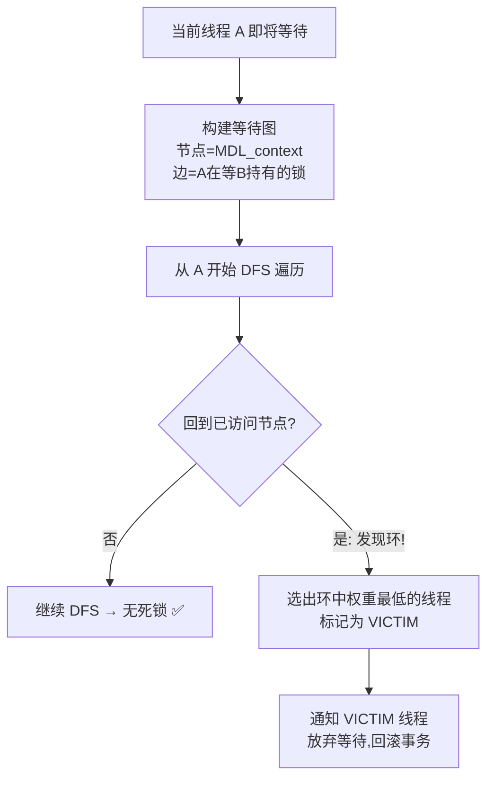
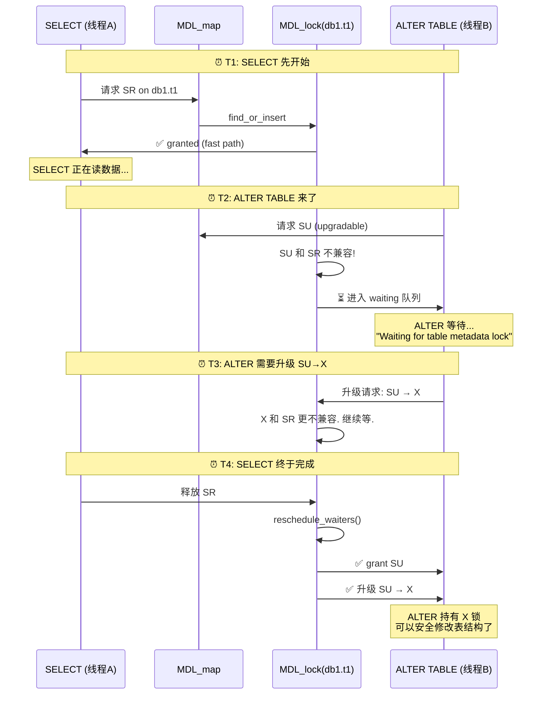

# MySQL MDL 入门到精通：Metadata Lock 的获取、等待与死锁

> **一句话理解 MDL：** MDL（Metadata Lock）是 MySQL 的"表结构锁"——它确保你在读数据（SELECT）时，别人不能同时改表结构（ALTER TABLE）。它是 DDL 和 DML 之间的仲裁者。

**读者定位：** 熟悉 MySQL 但不一定读过 MDL 源码。读完本文你将理解：MDL 锁类型图谱、锁获取流程、死锁检测原理、以及 `Waiting for table metadata lock` 这个经典报错背后的故事。

---

## 目录

1. [为什么需要 MDL？](#1-为什么需要-mdl)
2. [10 种锁类型速查](#2-10-种锁类型速查)
3. [锁获取全流程](#3-锁获取全流程)
4. [Fast Path：为什么 MDL 不拖慢你的查询](#4-fast-path为什么-mdl-不拖慢你的查询)
5. [死锁检测](#5-死锁检测)
6. [实战：SELECT 和 ALTER TABLE 的对决](#6-实战select-和-alter-table-的对决)
7. [常见坑与 FAQ](#7-常见坑与-faq)

---

## 1. 为什么需要 MDL？

想象这个场景：

```
时间线  线程 A (SELECT)              线程 B (ALTER TABLE)
─────────────────────────────────────────────────────────
T1      打开表 t1，开始读数据...
T2                                   删除列 col_3
T3      读到第 100 行                 ALTER 完成
T4      尝试读 col_3 → 💥 崩溃！
```

线程 A 打开表时 t1 有 10 列，读到一半时线程 B 删除了 col_3——线程 A 的表结构视图和磁盘上的实际结构不一致了。

**MDL 做的事：** 在 T1 给线程 A 发一把"共享读锁"（SR），在 T2 线程 B 申请"排他锁"（X）时被阻塞——直到线程 A 释放 SR。这样线程 A 的整个读过程看到的是同一个表结构。

---

## 2. 10 种锁类型速查

### 2.1 兼容矩阵

```
            IX  S  SH  SR  SW SWLP SU SRO SNW SNRW X
IX          +   +   +   +   +   +   +   +   +   +   -
S           +   +   +   +   +   +   +   +   +   -   -
SH          +   +   +   +   +   +   +   +   +   -   -
SR          +   +   +   +   +   +   -   -   -   -   -
SW          +   +   +   +   +   +   -   -   -   -   -
SU          +   +   +   -   -   -   -   -   -   -   -
SRO         +   +   +   -   -   -   -   -   -   -   -
SNW         +   +   +   -   -   -   -   -   -   -   -
SNRW        +   -   -   -   -   -   -   -   -   -   -
X           -   -   -   -   -   -   -   -   -   -   -
```

`+` = 兼容（可同时持有），`-` = 冲突（后来的必须等待）

**锁强度升序：** IX < S < SH < SR < SW < SU < SRO < SNW < SNRW < X

### 2.2 常见操作用什么锁？

| 操作 | 锁类型 | 说明 |
|---|---|---|
| SELECT（普通） | SR (Shared Read) | 允许并发读，阻止 DDL |
| INSERT/UPDATE/DELETE | SW (Shared Write) | 允许并发读写，阻止 DDL |
| SELECT ... FOR UPDATE | SR + InnoDB 行锁 | 仍然是 SR，行锁在 InnoDB 层 |
| LOCK TABLES t1 READ | S (Shared) | 更强的共享锁 |
| ALTER TABLE（第一阶段） | SU (Shared Upgradeable) | 允许读，阻止写——准备升级到 X |
| ALTER TABLE（最后阶段） | X (Exclusive) | 排他——谁也别碰这张表 |
| DROP TABLE | X | 彻底独占 |

### 2.3 三种锁时长

| 时长 | 释放时机 | 典型场景 |
|---|---|---|
| STATEMENT | 语句结束 | 大部分普通 DML |
| TRANSACTION | COMMIT/ROLLBACK | 事务中打开的表 |
| EXPLICIT | 手动 release_lock() | LOCK TABLES、备份工具 |

---

## 3. 锁获取全流程


**六个阶段拆解：**

| 阶段 | 做什么 | 关键函数 |
|---|---|---|
| 1. 零超时快速路径 | timeout=0 时直接 try，失败就报错 | `try_acquire_lock()` |
| 2. 无等待尝试 | 尝试获取锁，即使失败也创建 ticket | `try_acquire_lock_impl()` |
| 3. 入等待队列 | ticket 挂到 MDL_lock 的 waiting 链表 | `m_waiting.add_ticket()` |
| 4. 死锁检测 | 构图 → DFS → 选牺牲品 | `find_deadlock()` |
| 5. 条件等待 | 线程睡在 condition variable 上等唤醒 | `timed_wait()` |
| 6. 结果处理 | GRANTED=挂入 ticket_store / VICTIM/TIMEOUT=清理+报错 | `push_front()` |

> 📌 源码位置：`MySQL 9.6.0, sql/mdl.cc:3364` `MDL_context::acquire_lock()`

---

## 4. Fast Path：为什么 MDL 不拖慢你的查询

**这是 MDL 最重要的性能设计。** 绝大多数 DML 操作（99%+）的 MDL 请求走 fast path——零链表操作，零等待队列检查，零死锁检测。

### 4.1 哪些锁走 fast path？

四种轻量锁：
- `MDL_SHARED` (S)
- `MDL_SHARED_HIGH_PRIO` (SH)
- `MDL_SHARED_READ` (SR) ← SELECT 就用这个
- `MDL_SHARED_WRITE` (SW) ← INSERT/UPDATE/DELETE 用这个

### 4.2 Fast Path 怎么工作？

```
正常路径（slow path）:                Fast Path:
─────────────────────                ─────────
创建 ticket                          只 inc 原子计数器
挂入 MDL_lock.granted 链表           不需要创建 ticket!
检查兼容矩阵                          
检查 waiting 队列                     

→ 需要 MDL_lock 的读写锁             → 只需要原子操作
```

```cpp
// 概念代码（非实际源码）：
// MDL_lock::m_fast_path_locks_granted_counter
//   是一个原子变量，记录当前 fast path ticket 数量

fast_path_grant(ticket):
  atomic_inc(&m_fast_path_locks_granted_counter)
  // 完成。没有链表、没有锁。
```

### 4.3 Fast Path 什么时候"退化"？

当有一个 incompatible 的锁请求进入 waiting 队列时，所有 fast path ticket 必须"物化"（materialize）——补入 granted 链表。这样新来的重锁才能看到"有哪些轻锁挡在我前面"。

```
事件: ALTER TABLE 请求 SU 锁（与 SR 不兼容）
→ fast path SR ticket 全部物化到 granted 链表
→ ALTER 看到 granted 中的 SR ticket，确定自己必须等待
→ ALTER 进入 waiting 队列
```

---

## 5. 死锁检测

### 5.1 什么时候触发？

**每次线程准备进入等待队列时。** 检测发生在 `timed_wait()` 之前。

### 5.2 怎么检测？



### 5.3 死锁示例

```
线程 A: 持有 db1.t1 的 SR 锁 → 现在请求 db1.t2 的 X 锁 → WAITING
线程 B: 持有 db1.t2 的 SR 锁 → 现在请求 db1.t1 的 X 锁 → WAITING

等图: A → B (A 等 B 释放 t2 的锁)
      B → A (B 等 A 释放 t1 的锁)
      形成环 → 死锁!

检测结果: 比较 A 和 B 的权重，选权重低的作为 VICTIM
```

### 5.4 谁会被选为 VICTIM？

权重计算考虑：
- **锁类型越强，权重越高**（持有 X 锁的不容易被牺牲）
- **等待时间越长，权重越低**（等得久更容易被牺牲——"你已经等很久了，再等也没意义"）
- **有 commit order wait 的优先级更高**

---

## 6. 实战：SELECT 和 ALTER TABLE 的对决

这是最经典的 MDL 交互场景——也是 `Waiting for table metadata lock` 报错的根源。



**关键理解：** 
- 在 T2-T4 之间，**任何新的 SELECT 也能正常获取 SR**（因为 SR 和 waiting 的 SU 兼容）——所以读不阻塞
- 但 ALTER 必须等**所有已有的 SR 释放**后才能开始
- 如果有一个长事务（一直不释放 SR），ALTER 就永远等下去

---

## 7. 常见坑与 FAQ

### 🔴 坑 1：长事务阻塞 DDL

```
-- 会话 A: 开启事务后忘了关闭
BEGIN;
SELECT * FROM t1;  -- 获取 t1 的 SR (TRANSACTION 级别)
-- 去吃饭了...

-- 会话 B:
ALTER TABLE t1 ADD COLUMN c4 INT;  
-- 💥 永远等待！A 不提交，SR 不释放，ALTER 拿不到 SU/X
```

**排查命令：**
```sql
-- 查看当前所有 MDL 等待
SELECT * FROM performance_schema.metadata_locks 
WHERE OBJECT_NAME = 't1';

-- 找谁持有了锁不放
SELECT * FROM sys.schema_table_lock_waits;
```

### 🔴 坑 2：在线 DDL 的"脆弱窗口"

```sql
ALTER TABLE t1 ADD COLUMN c4 INT, ALGORITHM=INPLACE;
```

INPLACE DDL 分三个阶段：
1. 获取 SU → 准备（此时 DML 继续）
2. **短暂升级到 X → 提交元数据变更**（这瞬间 DML 全部阻塞）
3. 释放 X

虽然叫"在线 DDL"，但第 2 步有一个短暂的 X 锁窗口。在高并发下，这个窗口可能导致大量 DML 堆积。

### 🔴 坑 3：LOCK TABLES 引发的死锁

```sql
-- 会话 A
LOCK TABLES t1 READ;  -- 持有 t1 的 S 锁
SELECT * FROM t2;     -- 隐式请求 t2 的 SR → 等会话 B

-- 会话 B
LOCK TABLES t2 READ;  -- 持有 t2 的 S 锁
SELECT * FROM t1;     -- 隐式请求 t1 的 SR → 等会话 A
                      -- 💥 死锁!
```

**建议：** 尽量避免 `LOCK TABLES`，用事务 + InnoDB 行锁代替。

---

### FAQ

**Q: `Waiting for table metadata lock` 怎么排查？**

```sql
-- 方法 1：看谁在等 MDL
SELECT * FROM performance_schema.metadata_locks 
WHERE OWNER_THREAD_ID != THREAD_ID();

-- 方法 2：直接看等待关系
SELECT * FROM sys.schema_table_lock_waits;
```

**Q: MDL 和 InnoDB 行锁是什么关系？**

MDL 是 Server 层锁，保护**表结构**（元数据）。InnoDB 行锁是引擎层锁，保护**行数据**。它们是两个独立的层次——一条 UPDATE 先拿 MDL SW，再拿 InnoDB 行锁。

**Q: Fast path 什么时候会变成瓶颈？**

Fast path 本身不会——但当一个 ALTER TABLE 进来时，所有 fast path ticket 需要物化（materialize）。如果在物化过程中有大量新的 fast path 请求到达，物化操作需要持写锁遍历 granted 链表——这个写锁会短暂阻塞新的 fast path 请求。不过这种场景罕见，通常只在极高并发 + 频繁 DDL 时出现。

**Q: 死锁检测的性能消耗大吗？**

只在线程即将等待时触发一次。大多数情况下等图很小（2-3 个节点），DFS 毫秒级完成。但如果系统中有大量线程在互相等待（比如 100+ 线程在等不同的表），等图节点数增加，DFS 时间线性增长。MySQL 没有死锁检测的频率限制——每次进入 waiting 都检测。

---

> 📖 深入阅读：[MDL 源码完整分析](content/2026-05-17-mysql-mdl-source-analysis.md) by @mns-reader — 含完整代码片段、数据结构内存布局、acquire_lock() 逐行批注
