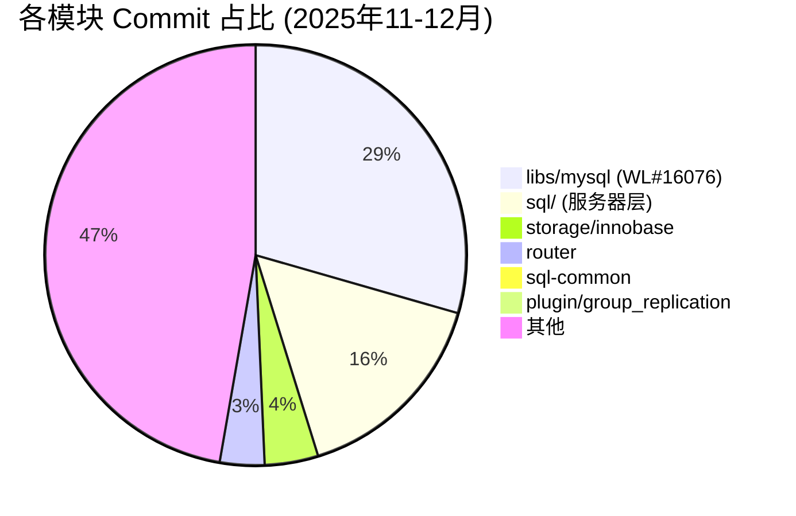

# MySQL 9.6.0 (trunk) 近期开发活动分析

> **基线：** MySQL 9.6.0 (trunk)，HEAD commit `447eb26e094`（2025-12-23）。
> **覆盖范围：** 148 个非合并 commit，2025年11月–12月。2026年1月–5月零新提交。

---

## 概览



**最大单项投入是 WL#16076——由 Sven Sandberg 主导的 39 步 GTID/复制库重构**（44 commits），占全部非合并工作的约 29%。并行的还有 Lakehouse/HeatWave 特性、Audit Log 组件化，以及关键崩溃/DoS bug 修复。

---

## 1. WL#16076 — GTID 与复制库重构（39 commits）

### 是什么

对 MySQL 内部 C++ 库的彻底重新架构，建立清晰的抽象层：

- **GTIDs**（`gtids` 库）：新的数据结构，替代 `mysql::gtid::Gtid_set`
- **UUIDs**（`uuids` 库）：解析与比较
- **Sets**（`sets` 库）：泛型集合操作
- **字符串转换**（`strconv` 库）：安全的字符串↔数字转换
- **数学**（`math` 库）：`int_log`、`int_pow`、求和函数
- **容器**（`containers` 库）：`Basic_container_wrapper`、`map_or_set_assign`
- **范围与迭代器**（`ranges`、`iterators` 库）
- **元编程**（`meta` 库）：C++20 风格的 concept（回移植到 C++14）
- **调试**（`debugging` 库）：`MY_SCOPED_TRACE`、`Object_lifetime_tracker`、`oom_test`

### 关键 commit

| 步骤 | Commit | 说明 |
|------|--------|------|
| 39 | `5cd325a9b9f` | 在 mysqlbinlog 中使用新的 Gtid 数据结构 |
| 38 | `129723c8437` | 替换旧的 `mysql::gtid::Gtid_set` |
| 37 | `b781b664a4a` | 与 GTID_SUBSET 和 GTID_SUBTRACT 集成 |
| 36 | `a6ff21a5129` | 新增 gtids 库 |
| 35 | `a9421c575a2` | 新增 uuids 库 |
| 34 | `9f9a3ac8be1` | 新增 sets 库 |
| 32 | `50989798cc5` | 新增 strconv 库 |
| 27 | `e30861d3882` | 新增 ranges 库 |
| 26 | `2d34be2b9bd` | 新增 iterators 库 |
| 13 | `784c130f6cd` | 新增 debugging 库 |
| 4  | `11a78222be0` | 新增 meta 库 |

### 影响

- **全部位于 `libs/mysql/`**——被服务器、mysqlbinlog、router 和插件共同使用的共享库
- 步骤 36-39 将新库接入生产代码（GTID、mysqlbinlog）
- meta 库引入了可在 C++14 中使用的 C++20 concept 模式——编译期类型检查的模板元编程
- **关键变量生命周期：** 这些是 header-only 或 header+inline 库。无动态分配——尽可能使用 constexpr/编译期求值

### 并发安全

这些库本身是值类型（无共享可变状态）。安全性取决于服务器层如何使用——GTID 集合必须在线程间复制（而非共享）。

---

## 2. Lakehouse / HeatWave（4 个 WL）

| WL | 描述 | 模块 |
|----|------|------|
| WL#17186 | Lakehouse 文件级数据放置 | HeatWave |
| WL#17152 | 支持 Parquet 嵌套类型 | HeatWave |
| WL#17124 | 新增 ALTER TABLE 用于加载验证 | DDL/HeatWave |
| WL#17165 | Lakehouse 中所有 Schema 的联合 | HeatWave |

### 分析

HeatWave/Lakehouse 在 9.x 中继续是重点投资方向：
- **Parquet 嵌套类型**（WL#17152）：将 Parquet 支持从扁平 schema 扩展到 STRUCT、ARRAY、MAP 类型——对真实数据湖工作负载至关重要
- **文件级数据放置**（WL#17186）：控制 Lakehouse 文件到物理存储的映射
- **加载验证**（WL#17124）：新的 ALTER TABLE 操作用于验证 Lakehouse 数据加载

### 🔴 与 HeatWave 整体战略的关联

MySQL 9.x 的"Innovation"轨道是 HeatWave 特性的载体，这些特性无法进入 8.0/8.4 LTS。此处的 Parquet 和 Lakehouse 工作与云端独占的 HeatWave 服务不同——这些是服务器内置功能。

---

## 3. Audit Log 与可观测性（3 个 WL）

| WL | 描述 | 影响 |
|----|------|------|
| WL#12716 | Audit Log 插件组件化 | 架构级：从旧插件迁移到 MySQL 8.0 组件框架 |
| WL#17167 | PERFORMANCE_SCHEMA：增强 OTEL 日志插桩 | 可观测性：打通 P_S → OpenTelemetry |
| WL#17178 | 适配审计日志卸载到 LogAnalytics | 云集成 |

### 分析

- **WL#12716** 架构意义最大：将 Audit Log 组件化意味着它遵循与其他 MySQL 8.0 组件（keyring、clone 等）相同的模式。这支持动态加载/卸载和版本化 API。
- **WL#17167** 是可观测性布局：将 Performance Schema 的插桩接入 OpenTelemetry 日志。面向云原生监控栈（AWS CloudWatch、Azure Monitor、GCP Cloud Logging）。

---

## 4. 外键级联操作（WL#11249）

```
9e1e77fac10 WL#11249 - Support Foreign Key Cascading Operation in server
```

### 它可能实现了什么

外键级联操作（ON DELETE CASCADE、ON UPDATE CASCADE）传统上在存储引擎中执行。此 WL 将级联逻辑提升到 SQL 层，实现：
- 跨引擎级联（InnoDB → NDB 等）
- 更好的级联失败错误报告
- 潜在可能：并行级联执行

### 🔴 风险区域

FK 级联本质上是递归的，可能触发死锁。将其提升到服务器层增加了一条必须与存储引擎自身 FK 执行相协调的新代码路径。

---

## 5. 关键 Bug 修复

### 🔴 Bug#38573285 — CPU 消耗型拒绝服务查询（3 commits）

```
b56c64b2947 Bug#38573285 MySQL server: CPU-eating Denial_of_Service query
770772d3d70 Bug#38573285 MySQL server: CPU-eating Denial_of_Service query
ebdf65e0703 Bug#38573285 MySQL server: CPU-eating Denial_of_Service query
```

同一个 bug 三次独立提交——说明修复涉及多个子系统（可能是优化器 + 执行器）。这是本窗口内严重程度最高的 bug：一条精心构造的查询可以无限期消耗 100% CPU。

### 🔴 Bug#38448700 — EXPLAIN SELECT 导致服务器崩溃（3 commits）

```
44361ef23da Bug#38448700: Server crash with EXPLAIN SELECT on LEFT JOIN with derived table containing stored function and GROUP BY
2bc8767f591 Bug#38448700: Server crash with EXPLAIN SELECT on LEFT JOIN with derived table containing stored function and GROUP BY
572f252c253 Bug#38448700: Server crash with EXPLAIN SELECT on LEFT JOIN with derived table containing stored function and GROUP BY
```

EXPLAIN 上服务器崩溃——严重的稳定性问题。LEFT JOIN + 派生表 + 存储函数 + GROUP BY 的组合创建了一个复杂的优化计划，EXPLAIN 在其中遇到了未处理的边界情况。

### 🟡 Bug#38208188 — 批量插入 + GIS 索引崩溃

```
a9cf8c54580 Bug#38208188: Bulk inserts into temporary tables with GIS indexes will inevitably cause crashes
d338ba09220 Bug#38208188: Bulk inserts into temporary tables with GIS indexes will inevitably cause crashes
```

### 🟡 Bug#38680162 — SET PERSIST 重复条目

```
1a78995a233 Bug#38680162 SET PERSIST creates duplicate variable entries across sections after upgrade
```

### 🟡 Bug#38077617 — 初始握手中始终使用 caching_sha2_password

```
c3956ef47af Bug#38077617: MySQL 8.4 always uses caching_sha2_password in the initial connection handshake
```

---

## 6. Group Replication / Router

| WL | 描述 |
|----|------|
| WL#17008 | 为 GCS/XCOM trace 文件条目添加时间戳 |
| WL#17027 | 将 Router 易失性统计数据存储在专用表中 |
| WL#17184 | 允许重定义 secondary engine |

### 分析

- **WL#17008**：GCS/XCOM（Group Communication System）是 MGR 的共识层。为 trace 条目添加时间戳提升了可调试性——目前诊断 MGR 停顿需要按消息内容跨节点关联日志，而非按时间戳。
- **WL#17027**：Router 统计数据此前仅存于内存中。将其存入 `mysql_innodb_cluster_metadata` 支持历史分析（如"凌晨 3 点是否有路由问题？"）。
- **WL#17184**：允许在不删除/重建的情况下更改表的 secondary engine。与 HeatWave secondary engine 场景相关。

---

## 7. NDB Cluster 修复

本窗口内有多个 NDB 专项 bug 修复，表明 NDB Cluster 在持续维护中：
- `Bug#38608189` / `Bug#38608102` — ndbxfrm/ndb_restore 修复
- `Bug#38558868` — ndb_restore 并行度修复
- `Bug#38593666` — ndb_restore 跳过 FK 检查选项
- `Bug#38592288` — 备份/恢复报告差异

---

## 8. 构建与打包

- `BUG#38784394` — mysql 包在 FC43（Fedora）上冲突失败
- `BUG#38758163` — MSVC 19.29（VS16.11）构建修复
- `BUG#38730874` — pb2 mysql-trunk-cloud-asan 批量加载失败（ASAN 修复）
- `BUG#38330571` — cmake/abi_check.cmake 在 Windows 11 24h2 上卡死

---

## 关键变量：贡献者集中度

```
Sven Sandberg      44 commits  (WL#16076 — GTID 库重构)
Mauritz Sundell     8 commits  (NDB Cluster / 构建)
Frazer Clement      8 commits  (NDB Cluster)
Miroslav Rajcic     6 commits
Marc Alff           4 commits
Magnus Blåudd       4 commits
Knut Anders Hatlen  4 commits
Kajori Banerjee     4 commits
```

**148 个 commit 中的 44 个（30%）来自同一作者。** Sven Sandberg 明显是库现代化工作的主导者。

---

## 时间线分析

```
2025-11: 101 commits  ← 活动高峰（WL#16076 大量提交、Lakehouse 特性）
2025-12:  47 commits  ← 逐渐减少（bug 修复、post-push 修复、合并）
2026-01:   0 commits  ← 假期停摆
2026-02:   0 commits  ←
2026-03:   0 commits  ←
2026-04:   0 commits  ←
2026-05:   0 commits  ←（截至5月16日）
```

自上次提交（2025年12月23日）以来 5 个月的间隔值得注意。可能的解释：
1. Oracle 内部开发使用独立仓库；trunk 仅接收周期性合并
2. 假期延长至 Q1 规划期
3. 重大版本发布（9.6.0 GA）在独立稳定分支中进行

---

## 趋势与总结

1. **库现代化是 #1 投资。** WL#16076 对 `libs/mysql/` 的 39 步重构不是用户可见的功能——它是为未来 GTID/复制工作打基础。这表明复制团队正在为重要的功能推进做准备。

2. **HeatWave/Lakehouse 是 #2 优先级。** 四个 WL 涵盖 Parquet、数据放置、加载验证和 schema 联合。MySQL 9.x Innovation 是这些特性的载体。

3. **可观测性正在成熟。** Audit Log 组件化 + OTEL 插桩 + LogAnalytics 卸载 = 云原生可观测性栈。

4. **关键稳定性修复。** CPU 消耗型 DoS 查询和 EXPLAIN 崩溃 bug 各需 3 次提交——属于复杂的、跨子系统的修复。

5. **NDB Cluster 仍在积极维护**——尽管是细分市场引擎，来自 2 名专职工程师的 8 个 commit。

6. **Group Replication 增强是渐进式的**——时间戳、统计存储、secondary engine 重定义——而非架构级的。

7. **InnoDB 核心架构零变更。** 6 个 InnoDB commit 全部是 bug 修复，无新特性。InnoDB 在 9.x 此阶段表现为稳定/成熟。
