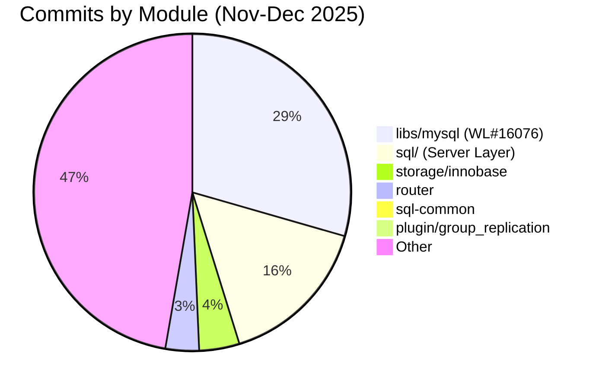

# MySQL 9.6.0 (trunk) Recent Development Activity Analysis

> **Baseline:** MySQL 9.6.0 (trunk), HEAD commit `447eb26e094` (2025-12-23).
> **Coverage:** 148 non-merge commits, Nov–Dec 2025. Zero new commits in 2026 (Jan-May).

---

## Executive Summary



**The single biggest effort is WL#16076 — a 39-step GTID/replication library refactoring** by Sven Sandberg (44 commits). This represents ~29% of all non-merge work. Parallel tracks include Lakehouse/HeatWave features, Audit Log componentization, and critical crash/DoS bug fixes.

---

## 1. WL#16076 — GTID & Replication Library Refactoring (39 commits)

### What it is

A ground-up re-architecture of MySQL's internal C++ libraries, building clean abstractions for:
- **GTIDs** (`gtids` library): new data structures replacing `mysql::gtid::Gtid_set`
- **UUIDs** (`uuids` library): parsing and comparison
- **Sets** (`sets` library): generic set operations
- **String conversion** (`strconv` library): safe string↔number conversion
- **Math** (`math` library): `int_log`, `int_pow`, summation functions
- **Containers** (`containers` library): `Basic_container_wrapper`, `map_or_set_assign`
- **Ranges & Iterators** (`ranges`, `iterators` libraries)
- **Meta-programming** (`meta` library): C++20-style concepts (backported to C++14)
- **Debugging** (`debugging` library): `MY_SCOPED_TRACE`, `Object_lifetime_tracker`, `oom_test`

### Key commits

| Step | Commit | Description |
|------|--------|-------------|
| 39 | `5cd325a9b9f` | Use new Gtid data structures in mysqlbinlog |
| 38 | `129723c8437` | Replace old `mysql::gtid::Gtid_set` |
| 37 | `b781b664a4a` | Integrate with GTID_SUBSET and GTID_SUBTRACT |
| 36 | `a6ff21a5129` | New gtids library |
| 35 | `a9421c575a2` | New uuids library |
| 34 | `9f9a3ac8be1` | New sets library |
| 32 | `50989798cc5` | New strconv library |
| 27 | `e30861d3882` | New ranges library |
| 26 | `2d34be2b9bd` | New iterators library |
| 13 | `784c130f6cd` | New debugging library |
| 4  | `11a78222be0` | New meta library |

### Impact

- **All in `libs/mysql/`** — a shared library consumed by server, mysqlbinlog, router, and plugins
- Steps 36-39 wire the new libraries into production code (GTIDs, mysqlbinlog)
- The meta-library introduces C++20 concept patterns usable in C++14 — this is template metaprogramming for compile-time type checking
- **Key variable lifecycle:** These are header-only or header+inline libraries. No dynamic allocation — everything is constexpr/compile-time where possible.

### Concurrency safety

The libraries themselves are value-type (no shared mutable state). Safety depends on how the server layer uses them — GTID sets must be copied (not shared) across threads.

---

## 2. Lakehouse / HeatWave (4 WL items)

| WL | Description | Module |
|----|-------------|--------|
| WL#17186 | Lakehouse file-based data placement | HeatWave |
| WL#17152 | Support for nested types in Parquet | HeatWave |
| WL#17124 | Add ALTER TABLE action for load validation | DDL/HeatWave |
| WL#17165 | Union of all Schemas in Lakehouse | HeatWave |

### Analysis

HeatWave/Lakehouse continues to be a major investment area in 9.x:
- **Parquet nested types** (WL#17152): Extending Parquet support beyond flat schemas to handle STRUCT, ARRAY, MAP types — critical for real-world data lake workloads
- **File-based data placement** (WL#17186): Control over how Lakehouse files map to physical storage
- **Load validation** (WL#17124): New ALTER TABLE action for validating Lakehouse data loading

### 🔴 Concurrent with the broader HeatWave strategy

MySQL 9.x's "Innovation" track is the vehicle for HeatWave features that can't land in 8.0/8.4 LTS. The Parquet and Lakehouse work here is distinct from the cloud-only HeatWave service — these are in-server features.

---

## 3. Audit Log & Observability (3 WL items)

| WL | Description | Impact |
|----|-------------|--------|
| WL#12716 | Audit Log plugin componentization | Architectural: moves from legacy plugin to MySQL 8.0 component framework |
| WL#17167 | PERFORMANCE_SCHEMA: instrument more OTEL logs | Observability: bridges P_S → OpenTelemetry |
| WL#17178 | Adapt audit log offload to LogAnalytics | Cloud integration |

### Analysis

- **WL#12716** is the most architecturally significant: componentizing the Audit Log means it follows the same pattern as other MySQL 8.0 components (keyring, clone, etc.). This enables dynamic loading/unloading and versioned APIs.
- **WL#17167** is the observability play: wiring Performance Schema instrumentation into OpenTelemetry logs. This is for cloud-native monitoring stacks (AWS CloudWatch, Azure Monitor, GCP Cloud Logging).

---

## 4. Foreign Key Cascading (WL#11249)

```
9e1e77fac10 WL#11249 - Support Foreign Key Cascading Operation in server
```

### What it likely enables

Foreign key cascading operations (ON DELETE CASCADE, ON UPDATE CASCADE) traditionally execute in the storage engine. This WL brings cascade logic into the SQL layer, enabling:
- Cross-engine cascading (InnoDB → NDB, etc.)
- Better error reporting for cascade failures
- Potentially: parallel cascade execution

### 🔴 Risk area

FK cascading is inherently recursive and can trigger deadlocks. Bringing it to the server layer adds a new code path that must coordinate with the storage engine's own FK enforcement.

---

## 5. Critical Bug Fixes

### 🔴 Bug#38573285 — CPU-eating Denial of Service query (3 commits)

```
b56c64b2947 Bug#38573285 MySQL server: CPU-eating Denial_of_Service query
770772d3d70 Bug#38573285 MySQL server: CPU-eating Denial_of_Service query
ebdf65e0703 Bug#38573285 MySQL server: CPU-eating Denial_of_Service query
```

Three separate commits for the same bug — suggests a complex fix touching multiple subsystems (likely optimizer + executor). This is the highest-severity bug in the window: a crafted query can consume 100% CPU indefinitely.

### 🔴 Bug#38448700 — Server crash with EXPLAIN SELECT (3 commits)

```
44361ef23da Bug#38448700: Server crash with EXPLAIN SELECT on LEFT JOIN with derived table containing stored function and GROUP BY
2bc8767f591 Bug#38448700: Server crash with EXPLAIN SELECT on LEFT JOIN with derived table containing stored function and GROUP BY
572f252c253 Bug#38448700: Server crash with EXPLAIN SELECT on LEFT JOIN with derived table containing stored function and GROUP BY
```

Server crash on EXPLAIN — a critical stability issue. The combination of LEFT JOIN + derived table + stored function + GROUP BY creates a complex optimization plan where EXPLAIN hits an unhandled edge case.

### 🟡 Bug#38208188 — Bulk insert + GIS index crash

```
a9cf8c54580 Bug#38208188: Bulk inserts into temporary tables with GIS indexes will inevitably cause crashes
d338ba09220 Bug#38208188: Bulk inserts into temporary tables with GIS indexes will inevitably cause crashes
```

### 🟡 Bug#38680162 — SET PERSIST duplicate entries

```
1a78995a233 Bug#38680162 SET PERSIST creates duplicate variable entries across sections after upgrade
```

### 🟡 Bug#38077617 — caching_sha2_password always used in initial handshake

```
c3956ef47af Bug#38077617: MySQL 8.4 always uses caching_sha2_password in the initial connection handshake
```

---

## 6. Group Replication / Router

| WL | Description |
|----|-------------|
| WL#17008 | Add timestamps to GCS/XCOM trace file entries |
| WL#17027 | Store volatile router statistics in dedicated table |
| WL#17184 | Allow redefinition of secondary engine |

### Analysis

- **WL#17008**: GCS/XCOM (Group Communication System) is the consensus layer for MGR. Adding timestamps to trace entries improves debuggability — currently diagnosing MGR stalls requires correlating logs across nodes by message content rather than timestamps.
- **WL#17027**: Router statistics previously lived in-memory only. Storing them in `mysql_innodb_cluster_metadata` enables historical analysis (e.g., "was there a routing issue at 3 AM?").
- **WL#17184**: Allows changing a table's secondary engine without dropping/recreating. Relevant for HeatWave secondary engine scenarios.

---

## 7. NDB Cluster Fixes

Multiple NDB-specific bug fixes in the window, suggesting active NDB Cluster maintenance:
- `Bug#38608189` / `Bug#38608102` — ndbxfrm/ndb_restore fixes
- `Bug#38558868` — ndb_restore parallelism fix
- `Bug#38593666` — ndb_restore skip FK checks option
- `Bug#38592288` — backup/restore reporting discrepancies

---

## 8. Build & Packaging

- `BUG#38784394` — mysql packages failing with conflicts on FC43 (Fedora)
- `BUG#38758163` — MSVC 19.29 (VS16.11) build fix
- `BUG#38730874` — pb2 mysql-trunk-cloud-asan bulk load failures (ASAN fix)
- `BUG#38330571` — cmake/abi_check.cmake stalls on Windows 11 24h2

---

## Key Variable: Contributor Concentration

```
Sven Sandberg      44 commits  (WL#16076 — GTID library refactoring)
Mauritz Sundell     8 commits  (NDB Cluster / build)
Frazer Clement      8 commits  (NDB Cluster)
Miroslav Rajcic     6 commits
Marc Alff           4 commits
Magnus Blåudd       4 commits
Knut Anders Hatlen  4 commits
Kajori Banerjee     4 commits
```

**44 of 148 commits (30%) from one author.** Sven Sandberg is clearly the lead on the library modernization effort.

---

## Timeline Analysis

```
2025-11: 101 commits  ← Peak activity (WL#16076 bulk, Lakehouse features)
2025-12:  47 commits  ← Tapering (bug fixes, post-push fixes, merges)
2026-01:   0 commits  ← Holiday shutdown
2026-02:   0 commits  ←
2026-03:   0 commits  ←
2026-04:   0 commits  ←
2026-05:   0 commits  ← (through May 16)
```

The 5-month gap since the last commit (Dec 23, 2025) is notable. Possible explanations:
1. Oracle's internal development uses separate repositories; trunk only receives periodic merges
2. Holiday break extended into Q1 planning
3. Major release preparation (9.6.0 GA) in a separate stabilization branch

---

## Trends & Takeaways

1. **Library modernization is the #1 investment.** WL#16076's 39-step refactoring of `libs/mysql/` is not a user-visible feature — it's infrastructure for future GTID/replication work. This suggests the replication team is preparing for a significant feature push.

2. **HeatWave/Lakehouse is the #2 priority.** Four WL items covering Parquet, data placement, load validation, and schema union. MySQL 9.x Innovation is the vehicle for these features.

3. **Observability is maturing.** Audit Log componentization + OTEL instrumentation + LogAnalytics offload = cloud-native observability stack.

4. **Critical stability fixes.** The CPU-eating DoS query and EXPLAIN crash bugs required 3 commits each — complex, multi-subsystem fixes.

5. **NDB Cluster is actively maintained** despite being a niche engine — 8 commits from 2 dedicated engineers.

6. **Group Replication enhancements are incremental** — timestamps, stats storage, secondary engine redefinition — rather than architectural.

7. **Zero InnoDB core architecture changes.** The 6 InnoDB commits are all bug fixes, no new features. InnoDB appears stable/mature at this point in the 9.x cycle.
